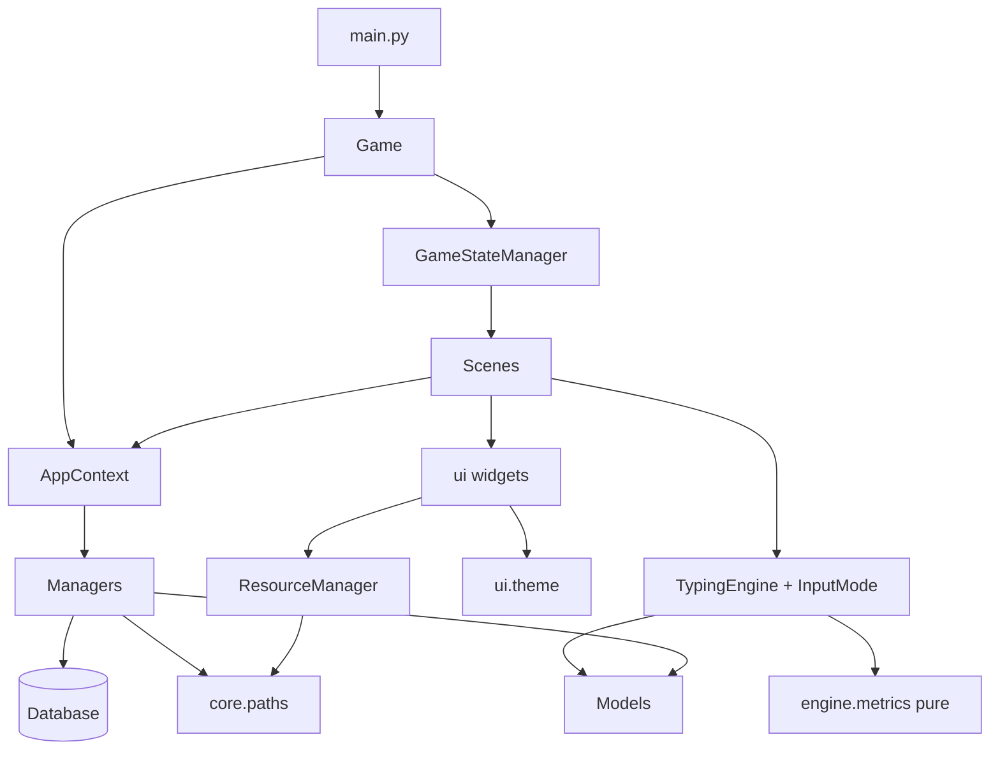
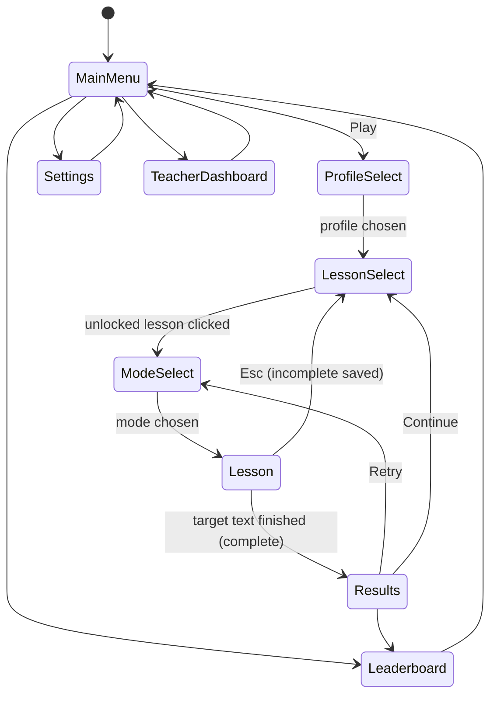
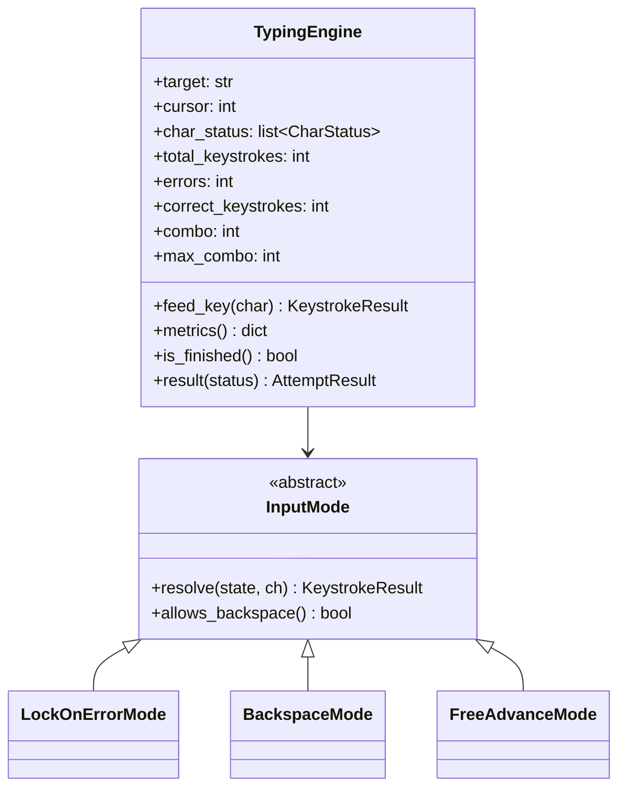
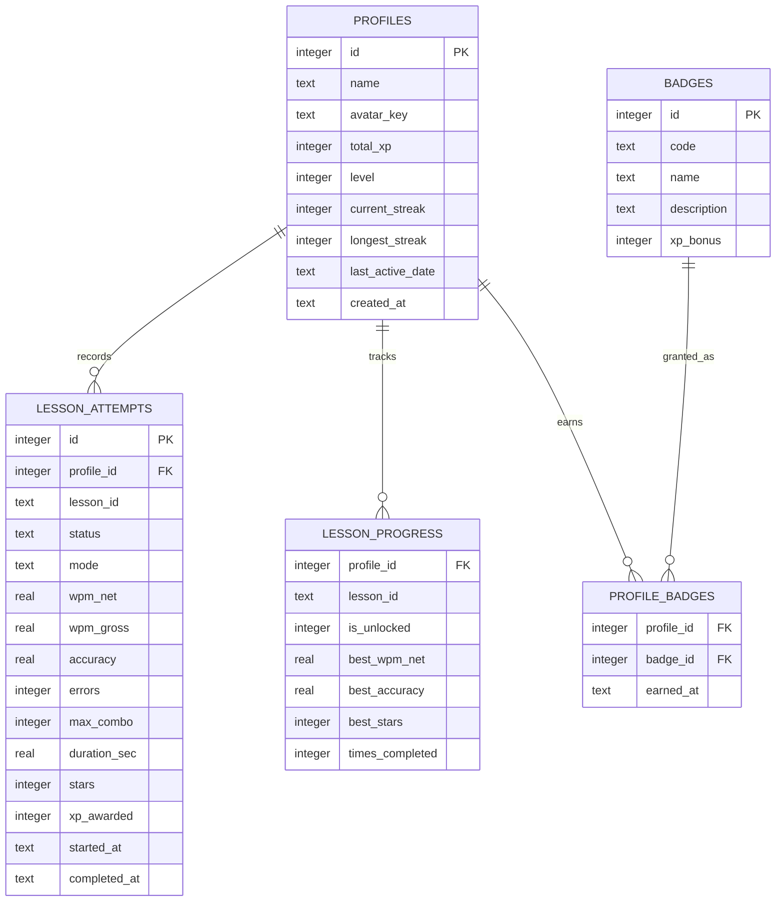
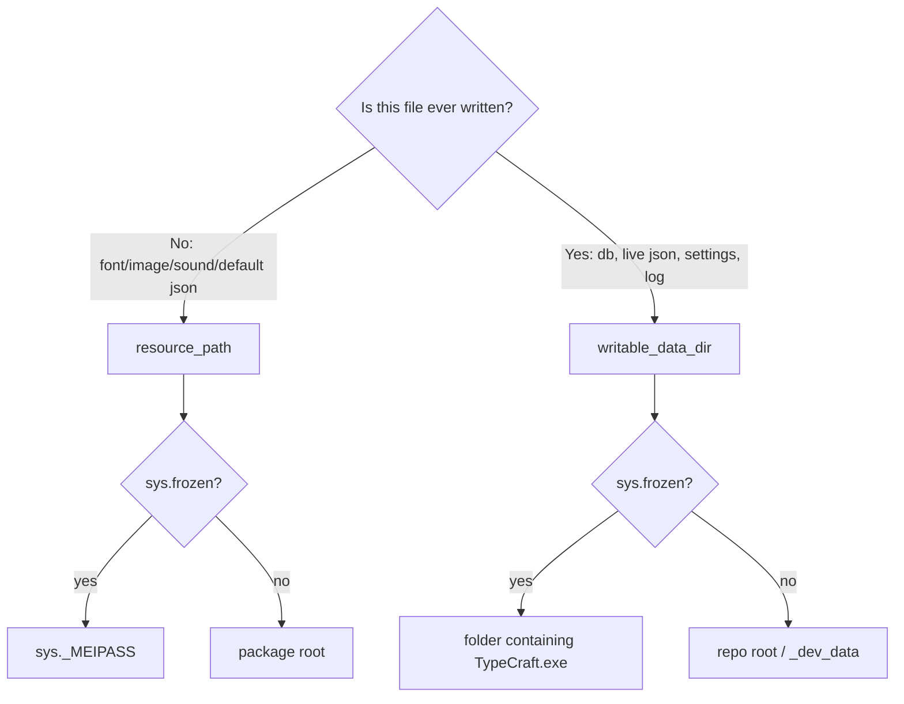

# TypeCraft — Architecture

**Status:** baseline v1.0, 2026-07-29. Sections marked **CURRENT** describe the code as
audited today. Sections marked **TARGET** describe where the phased plan takes it.
Anything not marked is true of both.

---

## 1. Repository structure

### 1.1 HISTORICAL — as inherited, before TC-002

> Superseded by §1.2 on 2026-07-29. Kept because several defect descriptions elsewhere in
> this document refer to the original layout.

The git repository root is `D:\CS\Projects\Type-Craft\TypeCraft` (`.git` lives there).
That same directory is *also* the Python package `TypeCraft`, because every module imports
absolutely as `from TypeCraft.core.game import Game`.

```
Type-Craft/                       (NOT a git repo — just a container folder)
└─ TypeCraft/                     <- git root AND the importable package
   ├─ __init__.py  main.py  README.md  requirements.txt (0 bytes)
   ├─ TypeCraft_Master_Blueprint.md
   ├─ TypeCraft Khidmat Proposal.pdf
   ├─ core/     app_context.py game.py paths.py scene.py state_manager.py
   ├─ engine/   input_modes.py metrics.py typing_engine.py
   ├─ managers/ badge_manager.py config_manager.py database.py lesson_manager.py
   │            lesson_manager.py profile_manager.py progression.py streak_manager.py
   ├─ models/   attempt.py lesson.py profile.py
   ├─ scenes/   main_menu profile_select lesson_select mode_select lesson results
   │            leaderboard teacher_dashboard settings
   ├─ ui/       widget button text_input keyboard_renderer hud progress_bar
   │            star_rating audio_manager resource_manager theme
   ├─ data/     lessons.json badges.json messages.json settings.default.json
   └─ _dev_data/ lessons.json badges.json messages.json settings.json typecraft.db
```

**Structural defect.** The package name equals the repository root directory name, so
`import TypeCraft.*` resolves only when the repo's *parent* directory is on `sys.path`.
Consequences: `python main.py` from the repo root fails; the repo cannot be renamed or
cloned to a differently-named folder; `pytest` from the repo root cannot import the code;
`assets/` does not exist at all; there is no `tests/`, no `TypeCraft.spec`, no
`.gitignore`, and `requirements.txt` is empty. `_dev_data/` is untracked but also
un-ignored.

Also note blueprint §3.1 shows `core/`, `engine/`, … directly at the project root, which
implies bare imports (`from core.game import Game`). The code deviates from the blueprint
by adding the `TypeCraft.` prefix. Neither arrangement is currently runnable from the repo
root.

### 1.2 CURRENT — after TC-002 (ADR-001, ADR-002)

Repository root stays where `.git` is. The application code moved one level down into a
lowercase package, so the root is a normal Python project root. `✔` = exists today;
`⬚` = created by a later task.

```
TypeCraft/                       <- git root, project root, sys.path[0]
├─ typecraft/                 ✔  <- the package (import prefix `typecraft.`)
│  ├─ __init__.py  __main__.py  main.py                    ✔
│  ├─ core/ engine/ managers/ models/ scenes/ ui/           ✔
│  ├─ assets/{images,fonts,sounds}/                         ✔ (empty, .gitkeep — TC-017)
│  └─ data/{lessons,badges,messages,settings.default}.json  ✔
├─ tests/{unit,db,scenes,conftest.py}                    ⬚  TC-004
├─ docs/                                                 ⬚  TC-021 (DOC-002…DOC-007)
├─ main.py                    ✔  <- launcher: `from typecraft.main import main`
├─ requirements.txt           ✔  (empty until TC-003)
├─ TypeCraft.spec  pyproject.toml  requirements-dev.txt  ⬚  TC-003 / TC-020
├─ .gitignore  .gitattributes  README.md                 ✔
├─ REQUIREMENTS.md ARCHITECTURE.md PROJECT_PLAN.md TASKS.md PROJECT_STATE.md  ✔
├─ _dev_data/                 ✔  <- writable dev data, git-ignored, NOT in the package
└─ TypeCraft_Master_Blueprint.md  "TypeCraft Khidmat Proposal.pdf"            ✔
```

Three equivalent entry points, all reaching `typecraft.main:main` —
`python main.py`, `python -m typecraft`, and (once built) `TypeCraft.exe`.

Rationale: `python main.py` and `pytest` both work from the repo root with no `sys.path`
manipulation; the package is relocatable; top-level generic names (`core`, `ui`, `models`)
are not injected into the global module namespace, which matters for PyInstaller module
collection and for test imports. Cost: one mechanical move plus a global
`TypeCraft.` → `typecraft.` import rewrite (TC-002). `assets/` and `data/` move **inside**
the package so `resource_path()` has a single, stable anchor whether frozen or not.

Rejected alternative: strip the prefix entirely (`from core.game import …`) to match
blueprint §3.1 literally. Cheaper (no file moves) but pollutes the global namespace with
`core`/`ui`/`models` and makes the code non-installable. Recorded as ADR-001-alt.

---

## 2. Layering



Dependency rules (enforced by review, and by an import-direction test in TC-004):

1. `engine.metrics` imports nothing from the project. Pure functions only.
2. `engine` may import `models`; never `managers`, `scenes`, `ui`, or `pygame`.
3. `models` imports only the standard library.
4. `managers` may import `models`, `engine.metrics`, `core.paths`, and `Database`; never `scenes`, `ui`, or `pygame`.
5. `ui` may import `ui.theme`, `models`, and `pygame`; never `managers` or `scenes`.
6. `scenes` may import everything except other scenes (transitions go through `GameStateManager` by name).
7. Only `core.paths` computes filesystem locations. Only `managers.database` imports `sqlite3`.

CURRENT deviations: none of these are violated today except that `managers.lesson_manager`
and `managers.profile_manager` import the `Database` *class* for type hints only (benign),
and `managers.badge_manager` opens JSON directly through `core.paths` (allowed).

---

## 3. Scene / state machine

`GameStateManager` holds a `name -> Scene subclass` registry and exactly one live scene.
`change(name, **kwargs)` calls `on_exit()` on the outgoing scene, **constructs a new
instance** of the incoming scene, then calls `on_enter(**kwargs)`.



**CURRENT:** scenes are constructed fresh on every transition, so no scene state leaks —
but it also means per-entry rebuild cost (Lesson Select re-queries the database and
re-lays out 20 cards on every entry; acceptable at 20, measured in TC-018).

**TARGET additions:** a `Scene.on_quit_requested() -> bool` hook so `Game` can let the
active scene persist an incomplete attempt before the process exits (FR-071), and a
`Scene.dirty_rects()` contract for FR/PR-002 dirty-rect rendering.

---

## 4. Event → Update → Render lifecycle

```mermaid
sequenceDiagram
    participant L as Game.run
    participant P as pygame.event
    participant S as active Scene
    participant D as display
    loop every frame
        L->>L: dt = clock.tick(30)/1000
        L->>P: event.get()
        P-->>L: QUIT / KEYDOWN / MOUSE*
        L->>S: handle_event(e)   (all input handled here only)
        L->>S: update(dt)        (timers, animation, checkpoint tick)
        L->>S: render(surface)   (blits only; no I/O, no rasterisation)
        L->>D: update(dirty_rects)
    end
```

Rules: input is read **only** in `handle_event`; `update` owns time-based state (blinking
cursor, elapsed-time display, the FR-073 checkpoint timer); `render` performs blits and
cached-surface lookups only.

**CURRENT violation (NFR-007/PR-002):** `Game._render()` does `screen.fill(bg)` then a
full `pygame.display.flip()` every frame — the whole 1280×720 surface is re-pushed and
every scene redraws itself unconditionally. `LessonScene._render_target_text()` also blits
one surface per target character (~150 blits) per frame. Text surfaces *are* cached, so no
rasterisation occurs per frame, but the blit and present cost is unnecessary.

**TARGET:** `Scene.render(surface)` returns (or accumulates into `self._dirty`) a list of
changed rects; `Game` calls `pygame.display.update(rects)`. Static scenes (menus, results)
mark themselves fully dirty once on entry and clean thereafter. The Lesson scene marks
only the HUD block, the changed characters of the target text, and the two keyboard keys
whose highlight changed. Full-surface repaint remains available behind a debug flag.

---

## 5. Services and managers

| Component | Responsibility | Must not |
|---|---|---|
| `core.paths` | The only source of filesystem locations: `resource_path`, `writable_data_dir`, `ensure_seeded`. TARGET adds `log_path()`. | Open or parse files (other than the seeding copy) |
| `core.app_context` | Constructs and holds the manager singletons; seeds JSON on first run | Contain gameplay logic |
| `core.game` | Window, clock, loop, display presentation, QUIT dispatch | Know any scene by behaviour |
| `core.state_manager` | Registry + exactly one active scene + transitions | Touch the database |
| `managers.database` | sqlite3 connection, schema bootstrap, migrations, `query`/`execute`, explicit transactions, startup `in_progress` reclassification | Contain domain rules |
| `managers.profile_manager` | Profile CRUD; seeds the first unlocked lesson on create | Compute XP or metrics |
| `managers.lesson_manager` | Load/validate `lessons.json`, tier/order sequence, `next_lesson_id`, `is_unlocked`, `unlock_next` (85 % rule) | Write attempts |
| `managers.progression` | The single writer of an attempt: persist row, update the progress cache, apply XP/level, streak, unlock, badges — in one transaction | Render |
| `managers.badge_manager` | Badge catalogue sync + criteria predicates + idempotent award | Define XP curve |
| `managers.streak_manager` | The D4 daily-streak state machine incl. clock-rollback guard | Read the clock itself (date is injected) |
| `managers.config_manager` | `settings.json` read/write, PIN hash + verify | Know about pygame or audio |
| `engine.metrics` | Pure formulas: accuracy, gross/net WPM, stars, XP, level, streak bonus | Any state or I/O |
| `engine.typing_engine` | One attempt: cursor, per-char status, counters, timing, `AttemptResult` | Branch on mode; touch the DB |
| `engine.input_modes` | The three wrong-key strategies | Mutate engine counters |
| `ui.resource_manager` | The only loader of images/fonts/sounds and the only caller of `font.render` | Know about scenes |
| `ui.audio_manager` | `pygame.mixer` wrapper, volume/mute, silent when no device | Read settings from disk |

**CURRENT gaps:** `AudioManager` is never actually asked to play anything and no
`assets/sounds` exist; `ConfigManager` values are never applied to `AudioManager` at startup
(FR-130); `ProgressionService` performs five separate auto-committed writes rather than one
transaction (DR-010).

`core/logging_setup.py` was added in TC-004 and is configured from `typecraft/main.py` at
startup: one rotating file at `log_path()` (512 KB × 2 backups), plus a console handler only
when not frozen. `configure_logging()` is idempotent and never raises — if the log file
cannot be opened it degrades to console-only or a `NullHandler`, because losing diagnostics
must never stop the app from starting. The FR-024/FR-134 **call sites** that should be using
it do not yet (TC-011, TC-017, TC-023).

---

## 6. Typing engine strategy pattern



`InputMode.resolve()` is a **pure decision function**: it reads the engine's cursor,
target, and char statuses and returns a `KeystrokeResult(advanced, is_error, char_status,
is_backspace, corrected_index)`. Only `TypingEngine.feed_key()` mutates counters. Modes are
created from a string key via `create_mode()` backed by `MODE_REGISTRY`.

**Accounting defects — ALL FIXED in TC-006 (Phase 2 complete).** Retained as the record of
what was wrong and what the tests now guard against; `engine/typing_engine.py` and
`engine/metrics.py` are at 100 % coverage.

1. `LockOnErrorMode` + `_error_counted[]`: a second wrong key at the same position
   increments `total_keystrokes` but is suppressed from `errors`, so
   `correct + errors != total` (FR-043) and the displayed mistake count understates
   reality. Accuracy is *under*-reported, not over-reported.
2. `BackspaceMode` correction: `_apply_backspace` does `errors -= 1; correct_keystrokes += 1`
   *and* the subsequent retype does `correct_keystrokes += 1` again — one physical
   keystroke credited twice, with `total_keystrokes` never decremented. Any attempt where
   every error is corrected reports 100 % accuracy and 0 mistakes with an inflated
   `total_keystrokes` (so gross WPM is inflated and `net == gross`). Violates FR-046.
3. Backspacing over an already-correct character clears its status to PENDING but leaves
   its `correct_keystrokes` credit in place; retyping it credits it a second time.
4. **D-30 — accuracy is farmable.** `BackspaceMode.resolve()` returns `is_backspace=False`
   when the cursor is at 0, so `feed_key()` skips the backspace branch and scores the
   Backspace on the normal path as a *correct keystroke*. 20 Backspace presses before typing
   anything yield 100 % accuracy and combo 20 — enough for 3 stars, an unlock, and a
   leaderboard place with zero characters typed. Defeats FR-061's 85 % gate outright.
5. **D-29 — the finished-guard is unreachable.** `feed_key()` calls `mode.resolve()`, which
   reads `target[cursor]`, *before* its own `if self.cursor >= len(self.target)` guard, so
   input after completion raises `IndexError` rather than being ignored (FR-047).

**Measured against the inherited code (TC-005): `engine/metrics.py` and all three
`InputMode` strategies are correct.** Every defect above is in `TypingEngine.feed_key()` /
`_apply_backspace()`. Note also that the FR-043 equation is necessary but not sufficient —
only D-08 unbalances it; D-07 and D-30 keep it balanced while corrupting the values, so the
fix must be verified against exact expected counters.

**Accounting as implemented (OQ-001 resolved blueprint-literal, TC-006).** The counters are a
ledger over keystrokes, not over cursor positions. Every character-producing keystroke posts
exactly one entry — `total += 1` plus either `correct += 1` or `errors += 1` — and **no entry
is ever reversed**. Backspace is navigation: it moves the cursor, clears the character it
uncovers, bumps the non-scoring `corrections_made`, and touches no metric. A repeated wrong key
in `LockOnErrorMode` posts a full entry each time (`_error_counted` deleted). A no-op backspace
still reports `is_backspace=True` so it can never reach the scoring path. Input after
completion is ignored, guarded before `mode.resolve()` is called.

This makes FR-043/FR-044/FR-045 true by construction. Note for future work: the ledger
equation alone is **not** a sufficient test — D-07 and D-30 both kept it balanced while
corrupting the values, so exact expected counters must be asserted (see
`tests/unit/test_invariants.py`'s docstring).

---

## 7. UI component architecture

`Widget` (ABC: `rect`, `visible`, `handle_event() -> bool`, `render(surface)`) →
`Button`, `TextInput`, `ProgressBar`, `StarRating`, `HUD`. `handle_event` returns `True`
when the widget consumed the event; scenes dispatch in priority order and stop on the
first `True`. `KeyboardRenderer` is deliberately not a `Widget` — it owns a pre-rendered
base surface plus a highlight overlay.

All colours, sizes, and the eight finger colours live in `ui.theme`. No scene or widget
hard-codes a colour.

**CURRENT gaps:** no scrollable container (blocks FR-014/FR-026/FR-124); `KeyboardRenderer`
has only 4 rows × 10 keys (no Space, Shift, `'`, `-`, `?`, `[`, `]`, `\``), highlights the
*key just typed* rather than the *next expected key* (FR-092), never indicates a finger
(FR-093), and `highlight(None)` for Space means Space is never shown at all. `HUD` reads a
metrics dict that omits `total_keystrokes`/`correct_keystrokes`.

**TARGET additions:** `ui.scroll_panel.ScrollPanel` (mouse wheel + drag + keyboard), a
`ui.keyboard_renderer` extended layout with a `CHAR_TO_KEY` map covering every character in
`lessons.json` plus shift-pair handling and a finger caption strip, and a
`ui.notice.NoticeBar` for the FR-024/FR-134 teacher-visible warnings.

---

## 8. SQLite schema

### 8.1 CURRENT (verified against `_dev_data/typecraft.db`)



Present: `idx_attempts_lookup(profile_id, lesson_id, status)`, the two composite primary
keys, `badges.code UNIQUE`, `PRAGMA foreign_keys = ON`. The dev database contains 10 badge
rows and zero profiles/attempts/progress rows.

### 8.2 CURRENT deltas — implemented in TC-008b as migration `v2`

- `lesson_attempts.total_keystrokes INTEGER NOT NULL DEFAULT 0` — required by FR-050/DR-003.
- `lesson_attempts.correct_keystrokes INTEGER NOT NULL DEFAULT 0` — same.
- `lesson_attempts.corrections_made INTEGER NOT NULL DEFAULT 0` — OQ-001 display counter.
- `schema_meta(key TEXT PRIMARY KEY, value TEXT)` holding `schema_version` so DR-009
  migrations are ordered and idempotent.
- `PRAGMA synchronous = FULL` for power-loss durability of the FR-073 checkpoint row, with
  the **default rollback journal, deliberately not WAL** (see ADR-012).
- `lesson_progress` gains no columns; the leaderboard filter uses `times_completed > 0`
  (FR-112).

Migrations live in `Database._migrate()`: additive-only, each `ALTER TABLE ADD COLUMN` guarded
by a `PRAGMA table_info` check so re-running is a no-op, all inside one transaction, gated on
the `schema_meta.schema_version` value. A school machine's database upgrades in place; an older
build opening a newer database simply ignores columns it does not know about. `AttemptResult`
and the `lesson_attempts` columns are now in sync (only `combo`, a live-only value, is
deliberately not stored — `max_combo` is what an attempt is judged on).

---

## 9. JSON content and configuration model

| File | Role | Written by | Read by |
|---|---|---|---|
| `data/lessons.json` | 5 tiers × 4 lessons, `schema_version: 1` | teacher (writable copy) | `LessonManager` |
| `data/badges.json` | 10 badge definitions (text + `xp_bonus`) | teacher | `BadgeManager` (syncs into the `badges` table by `code`) |
| `data/messages.json` | 4 encouragement bands | teacher | `ResultsScene` |
| `data/settings.default.json` | `volume`, `muted`, `teacher_pin_hash` | dev only | seed source for `settings.json` |

Criteria (when a badge is earned) are **code**, not content — only the display text and XP
bonus are editable. Lesson `id` values are stable database keys and must never be reused.

**CURRENT gaps:** `LessonManager` swallows the fallback silently (FR-024);
`ResultsScene._pick_message` re-opens and re-parses `messages.json` on every entry rather
than loading it once through a manager; there is no validation that a lesson's characters
are renderable by the keyboard widget; `settings.json` writes are not atomic (FR-135).

---

## 10. Read-only vs writable path strategy



**CURRENT (after TC-002):** implemented in `typecraft/core/paths.py` with two distinct
anchors, verified by execution:

- `_package_root()` = `typecraft/` — the anchor for `resource_path()` in dev, so `assets/`
  and `data/` travel with the package. Verified: all four `data/*.json` files and
  `assets/images` resolve.
- `_repo_root()` = `_package_root().parent` — used **only** to place
  `writable_data_dir()` at `<repo>/_dev_data` in dev, i.e. beside the package rather than
  inside it, so dev data can never be swept into a PyInstaller build. Verified: resolves to
  the pre-existing `_dev_data/` with `typecraft.db` intact, so the TC-008b migration fixture
  was not orphaned by the move.

Frozen behaviour is unchanged (`sys._MEIPASS` for read-only,
`Path(sys.executable).parent` for writable). `ensure_seeded()` skips any file that already
exists (DR-012) and maps `settings.json` to `settings.default.json`. `Database` puts the
`.db` in the writable dir. No module bypasses these helpers.

**TARGET:** a new `log_path()` returning `writable_data_dir()/"typecraft.log"` (TC-004).

---

## 11. Error handling and recovery

Four tiers:

1. **Programmer error** (unknown scene name, unknown mode key, missing lesson id) → raise
   immediately. These are bugs, not conditions.
2. **Teacher-data error** (malformed `lessons.json`/`badges.json`/`messages.json`/`settings.json`)
   → catch the specific exception (`json.JSONDecodeError`, `ValueError`, `KeyError`,
   `OSError`), fall back to the bundled default, record a `Notice` on `AppContext`, log to
   `typecraft.log`, and continue. The teacher sees a persistent banner (FR-024, FR-134).
3. **Environment degradation** (no audio device, missing optional asset) → degrade
   silently to a no-op, log once at startup. Never block gameplay.
4. **Data mutation failure** (any exception inside a transaction) → rollback, log, surface
   a child-safe "Couldn't save that — tell your teacher" notice, and keep the app running.
   Never leave a half-applied write.

**CURRENT:** tier 1 is right (`ValueError` for unknown scene/mode). Tier 2 catches the
right exceptions but is silent — no notice, no log. Tier 3 is right for audio. Tier 4 exists
only in `TeacherDashboardScene._reset_progress`, and its rollback is ineffective (§13).
There is no logging module at all.

**DONE in TC-004:** `core/logging_setup.py` (stdlib `logging`, rotating file handler at
`log_path()`, INFO default), wired from `typecraft/main.py`.

**TARGET:** `core/notices.py` (`AppContext.notices` list rendered by a
`NoticeBar` in every scene). `except Exception` remains permitted only in `Game.run()`'s
outermost guard (log + attempt an incomplete-attempt save + exit cleanly) and inside
transaction wrappers that re-raise after rollback.

---

## 12. Power-loss and incomplete-attempt strategy

Three save points for one attempt (FR-070…FR-076):

```mermaid
sequenceDiagram
    participant St as Student
    participant LS as LessonScene
    participant Eng as TypingEngine
    participant Pr as ProgressionService
    St->>LS: first keystroke
    LS->>Eng: feed_key
    Note over LS: checkpoint timer starts
    loop every ~10 s while typing
        LS->>Pr: checkpoint(engine) -> UPSERT status='in_progress'
    end
    alt finishes the text
        LS->>Pr: score(COMPLETE) -- promotes the in_progress row, one transaction
        LS->>LS: change("results")
    else presses Esc
        LS->>Pr: score(INCOMPLETE) -- promotes the in_progress row
        LS->>LS: change("lesson_select")
    else closes the window
        LS->>Pr: score(INCOMPLETE) via Scene.on_quit_requested()
    else power cut / kill
        Note over Pr: the in_progress row survives; startup reclassifies it to incomplete
    end
```

Key design points:

- The checkpoint is a single **UPSERT of one row per active attempt** (keyed by an
  `attempt_id` reserved on the first keystroke), so the final `complete`/`incomplete` write
  is an `UPDATE` of that same row, not a second insert. This is what prevents a crash from
  producing two rows for one attempt.
- The checkpoint interval is time-based (~10 s) and driven from `Scene.update(dt)`, never
  from `feed_key` — no database write on the keystroke path (NFR-007).
- Startup reclassification (`UPDATE … SET status='incomplete' WHERE status='in_progress'`)
  runs inside `Database._bootstrap()` **before** any aggregate is read.
- Aggregates are protected by construction: a single `completed_attempts_where()` SQL
  fragment helper is the only way any manager filters attempts.

**CURRENT:** startup reclassification is implemented (`Database._reclassify_orphaned_attempts`),
`AttemptStatus.IN_PROGRESS` exists, and Esc-with-keystrokes saves an `incomplete` row.
Nothing ever writes an `in_progress` row (FR-073 unimplemented), and `pygame.QUIT` sets
`running = False` in `Game._process_events()` with no notification to the active scene, so
a window-close mid-lesson silently loses the attempt (FR-071 unimplemented). The final
write is an INSERT, so once checkpointing exists it would duplicate rows unless the UPSERT
design above is adopted.

---

## 13. Transaction boundaries

Two multi-statement mutations must be atomic (DR-010):

**A. Score a completed attempt** — insert/promote the attempt row, upsert
`lesson_progress`, apply attempt XP, apply streak, unlock the next lesson, award badges and
their XP, recompute level, save the profile. All-or-nothing.

**B. Reset one student** — delete attempts, delete progress, delete badges, zero
XP/level/streaks, re-insert the first unlocked lesson. All-or-nothing.

**CURRENT (after TC-008): both are atomic.** `Database` opens with `isolation_level=None`
(autocommit), so a single `execute()` commits on its own and a group is opened explicitly by
`with db.transaction():` — `BEGIN IMMEDIATE`, commit on clean exit, rollback and **re-raise**
on any exception, and a hard refusal to nest (a nested `with` would commit the outer block
early, which is exactly the bug this replaced). `execute()` never commits while `_in_txn`.
`ProgressionService.score()` and `TeacherDashboardScene._reset_progress()` each wrap their
whole body in one transaction. `close()` discards any open transaction rather than leaving the
outcome to sqlite. Proven by forced failures — a Python exception, a SQL error, and a failure
injected into badge evaluation — each leaving every table unchanged.

One subtlety the tests pin down: `_award_xp()` and `BadgeManager.award()` mutate the **live
Profile object**, not only its row. A rolled-back transaction therefore used to leave the
in-memory profile holding XP that was never earned, which the next successful `save()` would
persist — a rollback that leaks. `score()` now snapshots and restores those fields on failure.

**Still open here:** `BadgeManager.award()` adds `xp_bonus` after `_award_xp()` has already
recomputed the level, so badge XP does not raise the level until the next attempt (D-11,
FR-083), and the daily streak bonus is never awarded at all (D-31, FR-057). Both are TC-013b.

---

## 14. Performance design for 30 FPS

| Rule | Mechanism | Status |
|---|---|---|
| No per-frame rasterisation | `ResourceManager.text_surface()` caches by `(text, font id, colour)` | CURRENT ✔ (cache is unbounded — NFR-014) |
| Convert images once at load | `convert()`/`convert_alpha()` in `ResourceManager.image()` | CURRENT ✔ (untested: no `assets/` exists) |
| Pre-render the keyboard | `KeyboardRenderer.prerender()` builds one base surface per lesson entry | CURRENT ✔ |
| Event-driven metrics | HUD updated on keystroke | CURRENT ✖ — `LessonScene.update()` also refreshes every frame; harmless (no I/O) but the elapsed-time string changes only once per second, so the HUD should be marked dirty at most 1 Hz |
| No I/O on the frame path | — | CURRENT ✔ |
| Dirty-rect presentation | `pygame.display.update(rects)` | CURRENT ✖ — full `fill()` + `flip()` |
| Cheap per-char text | one cached glyph blit per character | CURRENT ✖ — ~150 blits/frame; TARGET pre-composites the target text into per-status line surfaces and re-composites only the changed line |
| Bounded caches | cap or clear on scene exit | CURRENT ✖ — `clear_text_cache()` exists but is never called |

Measurement protocol (TC-018): instrument `Game.run()` behind a `--profile` flag to log
per-phase timings and blit counts to CSV, capture a 60-second Lesson-scene baseline, apply
one change, re-measure, and record both numbers in `PROJECT_STATE.md`. No optimisation
lands without a before/after number, except the two obvious frame-loop violations above.

---

## 15. Test architecture

```
tests/
├─ conftest.py          # tmp_path-backed writable dir + resource dir fixtures,
│                       #   SDL_VIDEODRIVER=dummy / SDL_AUDIODRIVER=dummy for scene tests,
│                       #   a `db` fixture on a temp sqlite file, a `ctx` fake AppContext
├─ unit/                # no pygame, no sqlite: metrics, input modes, typing engine,
│                       #   streak state machine, PIN hashing, lesson ordering/unlock
├─ db/                  # real temp sqlite: schema bootstrap, migrations, profile create,
│                       #   complete vs incomplete persistence, orphan reclassification,
│                       #   progress cache, leaderboard filtering, badge idempotency,
│                       #   XP/level incl. badge bonus, atomic reset + forced-failure
│                       #   rollback, first-run seeding, malformed-JSON fallback + notice
└─ scenes/              # SDL dummy driver: app init, every registered scene enters and
                        #   renders, main transitions, completion -> results, Esc and
                        #   window-close incomplete saves, settings persistence,
                        #   dashboard auth + reset confirmation
```

Isolation rules: no test touches `_dev_data/` or the developer's real database — the
`writable_data_dir` fixture monkeypatches `core.paths.writable_data_dir` to a `tmp_path`.
No test sleeps for timing; `TypingEngine`'s clock is injected (TARGET: constructor takes a
`clock=time.monotonic` callable) so WPM is deterministic. Streak tests inject `today`.
Property tests (`hypothesis` optional, else a seeded random loop) assert the FR-043/044/045
invariants over random keystroke sequences in all three modes.

Packaging tests (TC-020/TC-022) are a scripted checklist plus an automated smoke test that
builds `onedir`, launches the exe with `SDL_VIDEODRIVER=dummy` and a self-exit flag,
asserts the writable files appeared beside the exe and **not** under `_internal/`, then
relaunches and asserts the profile row survived.

**CURRENT (after TC-004):** `tests/conftest.py` and `tests/unit/` exist; 154 tests pass.
Fixtures provided: `writable_dir` (redirects the writable data dir into `tmp_path`),
`seeded_dir` (same, after first-run seeding, so first-run behaviour stays separately
testable), `db` (a `Database` on a throwaway file), `display` (headless 1280×720 via the
dummy SDL driver), `app_ctx` (a fully-wired `AppContext` on isolated paths), `profile` (a
created student with lesson 1 unlocked). `tests/db/` and `tests/scenes/` land in TC-007 and
TC-019.

**Isolation caveat worth knowing before writing a fixture.** Production modules use
`from typecraft.core.paths import writable_data_dir`, which binds the *function object* into
each importing module's namespace at import time. Patching only `typecraft.core.paths` would
leave `managers.database`, `managers.lesson_manager`, `managers.badge_manager`,
`managers.config_manager`, and `scenes.results` still pointing at the real folder. The
`writable_dir` fixture therefore patches every already-imported `typecraft.*` module holding
such a binding, *plus* the `paths` module itself so modules imported later inherit the
redirect. `tests/unit/test_data_isolation.py` asserts that no binding escaped.
Calling `paths.writable_data_dir()` at each call site would need no patching at all — a
worthwhile cleanup, but it touches five production modules and is not scheduled.

Baseline coverage recorded at TC-004 (from import/layering/isolation/logging tests alone,
before any behavioural test exists): **34 % overall**, `engine/` + `managers/` **29 %**.
AC-02 requires `engine/` + `managers/` ≥ 85 %; Phase 2 and Phase 3 close that gap.

---

## 16. PyInstaller deployment architecture

```
dist/TypeCraft/
├─ TypeCraft.exe            <- --windowed, --name TypeCraft, --icon
├─ _internal/               <- read-only bundle: python runtime, pygame,
│   ├─ typecraft/assets/…   #   images / fonts / sounds
│   └─ typecraft/data/…     #   DEFAULT lessons/badges/messages/settings.default
├─ typecraft.db             <- created on first run (writable)
├─ lessons.json  badges.json  messages.json  settings.json   <- seeded on first run
└─ typecraft.log
```

- `onedir`, not `onefile`: `onefile` re-extracts the whole app to `%TEMP%` on every launch,
  which is slow on 4th-gen Intel with a spinning disk, and puts the writable dir in a
  temporary location.
- `datas=[("typecraft/assets", "assets"), ("typecraft/data", "data")]` — the bundle
  destination **drops** the package prefix, because `resource_path()` takes paths relative to
  the package root (`"data/lessons.json"`, `"assets/images/…"`) and its frozen base is
  `sys._MEIPASS` itself. Mapping to `"typecraft/data"` instead would put the files one level
  too deep and every resource lookup would miss.
- `writable_data_dir()` = `Path(sys.executable).parent` = the `dist/TypeCraft/` folder, so
  student data sits beside the exe and an "update" that replaces `TypeCraft.exe` +
  `_internal/` preserves it (PK-008).
- Backup = copy `typecraft.db`. Restore = drop it back beside the exe.

**CURRENT: no `.spec` file, no `assets/` directory, no build has ever been produced.**

---

## 17. Frozen interface contracts

Changing any signature below requires updating this file **first** (per the development
rules), because tests and multiple call sites depend on them.

```python
# core/paths.py
resource_path(relative: str) -> Path
writable_data_dir() -> Path
ensure_seeded(filenames: Iterable[str], defaults_subdir: str = "data") -> None
log_path() -> Path

# core/logging_setup.py
configure_logging(level: int = logging.INFO, to_console: bool | None = None) -> Logger
get_logger(name: str | None = None) -> Logger
reset_logging() -> None                              # test teardown only

# core/scene.py
class Scene:
    on_enter(**kwargs) -> None
    on_exit() -> None
    handle_event(event) -> None
    update(dt: float) -> None
    render(surface) -> None
    on_quit_requested() -> None                      # TARGET (FR-071)

# engine/input_modes.py
class InputMode:
    resolve(state, typed_char: str) -> KeystrokeResult   # "\b" signals Backspace
    allows_backspace() -> bool
create_mode(mode_key: str) -> InputMode

# engine/typing_engine.py
TypingEngine(target, mode, profile_id, lesson_id, mode_key, tier, clock=time.monotonic)
    feed_key(char: str) -> KeystrokeResult
    metrics() -> dict
    is_finished() -> bool
    result(status: AttemptStatus | None = None) -> AttemptResult

# managers/database.py
Database(db_filename: str = "typecraft.db")
    query(sql: str, params: tuple = ()) -> list[dict]
    execute(sql: str, params: tuple = ()) -> int     # commits unless inside transaction()
    transaction() -> ContextManager[None]            # preferred; refuses to nest
    begin() / commit() / rollback() -> None          # for call sites that cannot use `with`
    in_transaction -> bool                           # property
    close() -> None

# managers/progression.py
ProgressionService.score(attempt: AttemptResult, profile: Profile) -> AttemptResult
ProgressionService.checkpoint(engine: TypingEngine, profile: Profile) -> None   # TARGET

# managers/lesson_manager.py
LessonManager.load_file() -> None
LessonManager.tiers() -> list ; get(id) -> Lesson ; first_lesson() -> Lesson | None
LessonManager.next_lesson_id(id) -> str | None
LessonManager.is_unlocked(profile, lesson_id) -> bool
LessonManager.unlock_next(profile, completed_lesson_id, accuracy) -> None

# managers/config_manager.py
ConfigManager.get(key, default=None) ; set(key, value) -> None
ConfigManager.verify_pin(raw) -> bool ; set_pin(raw) -> None ; has_pin() -> bool
```

`AttemptResult`, `KeystrokeResult`, `CharStatus`, `AttemptStatus`, `Profile`, and `Lesson`
field names are part of the contract; `AttemptResult` must stay a superset of the
`lesson_attempts` columns.

---

## 18. Architecture decisions

| ID | Decision | Status | Rationale / consequence |
|---|---|---|---|
| ADR-001 | Move code into a lowercase `typecraft/` package at the repo root; `main.py` launcher at root | **Accepted — implemented TC-002** | Repo now imports and tests from its own root; cost was an 88-statement import rewrite across 27 files |
| ADR-002 | `assets/` and `data/` live *inside* the package; `_dev_data/` stays outside it | **Accepted — implemented TC-002** | One stable anchor for `resource_path()` in both dev and frozen modes; dev data cannot be swept into a build |
| ADR-003 | `Database` uses `isolation_level=None` + an explicit `transaction()` context manager | **Accepted — implemented TC-008** | Per-statement autocommit made DR-010 unachievable; nesting is refused so an inner block cannot commit an outer one early |
| ADR-004 | One row per attempt, reserved on the first keystroke, promoted from `in_progress` to `complete`/`incomplete` | Proposed (TC-009) | Prevents duplicate rows once checkpointing exists |
| ADR-005 | Ledger-style keystroke accounting; delete `_error_counted`; Backspace never edits a counter | **Accepted — implemented TC-006** | FR-043/044/045 now hold by construction; fixed D-07, D-08, D-29, D-30 |
| ADR-006 | PIN uses `pbkdf2_hmac` with a per-install random salt, verified with `compare_digest` | Proposed (TC-011b) | A 4-digit unsalted SHA-256 has only 10 000 preimages |
| ADR-007 | Dirty-rect presentation via a per-scene dirty-rect list; full repaint behind a debug flag | Proposed (TC-018) | PR-002; keeps a simple escape hatch for debugging |
| ADR-008 | Lessons joined with a single space; no Enter key mid-lesson | Accepted (in code) | Keeps the target a flat string and the keyboard free of an Enter highlight |
| ADR-009 | Badge criteria in code, badge text/XP in JSON | Accepted (in code) | Teachers edit wording safely; criteria stay verifiable |
| ADR-010 | Scenes are re-instantiated on every transition | Accepted (in code) | No stale state; re-entry cost measured in TC-018 |
| ADR-011 | Leaderboard reads the `lesson_progress` cache, filtered by `times_completed > 0` | Proposed (TC-012) | One indexed row per lesson instead of scanning attempts; fixes FR-112 |
| ADR-012 | `synchronous = FULL` with the **default rollback journal — not WAL** | **Accepted — implemented TC-008** | WAL was specified in an earlier draft of §8.2 and is wrong for this deployment. In WAL mode recently-committed data can live in `typecraft.db-wal` rather than the main file, so after a crash **copying `typecraft.db` alone would silently lose it** — breaking DR-014's single-file backup story and the blueprint's "copy typecraft.db to your USB stick" instruction to teachers. The rollback journal deletes itself on commit, so the `.db` file is always a complete snapshot, and `synchronous = FULL` still fsyncs every commit. The cost is slower concurrent writes, which is irrelevant for one local single-user process. |

## 19. Architecture risks

| Risk | Impact | Mitigation |
|---|---|---|
| ~~R1 — the import-path/package defect blocks every test and the build~~ | — | **CLOSED by TC-002.** Both entry points resolve the full internal import graph from the repo root |
| ~~R2 — auto-commit `Database` silently defeats every transaction~~ | — | **CLOSED by TC-008.** `transaction()` context manager; `score()` and the teacher reset are each atomic, proven by forced-failure rollback tests |
| ~~R3 — keystroke accounting is wrong in two modes~~ | — | **CLOSED by TC-006.** Four defects fixed (D-07, D-08, D-29, D-30) and verified; `engine/` at 99 % coverage. Metrics are now trustworthy; persisting them is not yet (R2, R4) |
| R4 — no `in_progress` checkpoint and no window-close save | Silent data loss on a school power cut | TC-009, TC-010 |
| R5 — `assets/` missing entirely | Any future `image()`/`sound()` call crashes; no audio at all | TC-017 with graceful fallbacks and a placeholder generator |
| R6 — dirty-rect refactor destabilises working scenes | Visual regressions late in the project | Do it after TC-019 scene smoke tests exist; keep the full-repaint flag |
| R7 — no logging | Field failures at the school are undiagnosable | **Facility CLOSED by TC-004** (`core/logging_setup.py`, wired at startup, tested). The FR-024/FR-134 call sites still need it — TC-011, TC-017, TC-023 |
| ~~R8 — `_dev_data/` is untracked and un-ignored~~ | — | **CLOSED by TC-001.** `.gitignore` added and both `_dev_data/` and `__pycache__/` proven ignored |
| ~~R9 — schema missing keystroke columns~~ | — | **CLOSED by TC-008b.** Migration v2 with `schema_meta` versioning; verified on the real inherited database |
