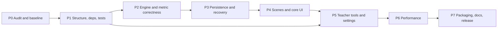

# TypeCraft — Phased Implementation Plan

**Baseline:** 2026-07-29. No calendar deadlines are asserted — phases are ordered by
dependency and gated by evidence. "Effort" is a rough human-developer estimate used only
for slicing tasks, not for scheduling.

Audit outcome that shaped the order: the repository does not currently import from its own
root, has no dependency manifest and no tests, and has two data-integrity defects
(non-transactional writes, no crash checkpoint). So Phase 1 is genuinely blocking, and the
correctness phases must precede all UI work. The recommended sequence in the assignment is
kept, with two clarifications:

- Phase 3 is split so the **database transaction repair (TC-008) lands before** the
  checkpoint/recovery work that depends on it.
- A schema migration task (TC-008b) is added because `lesson_attempts` is missing the
  `total_keystrokes` / `correct_keystrokes` columns that FR-050 requires.

---

## Phase 0 — Repository audit and reproducible baseline

**Objectives.** Establish exactly what exists, what runs, and what is broken, without
changing production code. Produce the five control files and a `.gitignore` so that
`_dev_data/` and `__pycache__/` can never be committed by accident.

**Dependencies.** None.

**Outputs.** `REQUIREMENTS.md`, `ARCHITECTURE.md`, `PROJECT_PLAN.md`, `TASKS.md`,
`PROJECT_STATE.md`, `.gitignore`, a recorded inventory (file list, line counts, compile
result, DB contents) in `PROJECT_STATE.md`.

**Risks.** Mis-reading the blueprint as authoritative where the code differs; missing a
latent defect and discovering it in Phase 6. Mitigated by converting every confirmed
finding into a task immediately.

**Test gate.** `python -m compileall` succeeds on every module (already verified). The
control files are internally consistent: every task references a real requirement id and
every requirement id appears in at least one task.

**Definition of done.** All five control files exist, traceability is complete, no
production file has been modified, and `PROJECT_STATE.md` records every command run and its
result.

---

## Phase 1 — Package structure, environment, and test infrastructure

**Objectives.** Make the repository importable, installable, and testable from its own
root; pin dependencies; stand up pytest with fully isolated data paths so no test can touch
a real database.

**Dependencies.** Phase 0.

**Tasks.** TC-001, TC-002, TC-003, TC-004.

**Outputs.** `typecraft/` package (ADR-001) with `assets/` and `data/` inside it (ADR-002);
root `main.py` shim; `requirements.txt` + `requirements-dev.txt`; `pyproject.toml` with
pytest config; `tests/` with `conftest.py` providing a `tmp_path` writable-dir fixture, a
temp-SQLite `db` fixture, and SDL dummy-driver fixtures; `core/logging_setup.py`.

**Risks.** The import rewrite touches every module at once — the one unavoidable wide
change. Mitigated by making it purely mechanical (no logic edits in the same task),
verifying with `compileall` plus an import-every-module test, and committing it alone.

**Test gate.** From the repo root: `python -m compileall .` clean; `pytest -q` collects and
passes (initially with a single import-smoke test that imports every module); a test proves
`writable_data_dir()` is redirected under `tmp_path` and that `_dev_data/` is untouched
after a full run.

**Definition of done.** `python main.py` starts from the repo root; `pytest` runs from the
repo root with zero import errors; dependency files are non-empty and pinned; a documented
one-command dev setup works from a clean virtual environment.

---

## Phase 2 — Typing engine and metric correctness

**Objectives.** Make the numbers trustworthy. Lock the FR-043/044/045 invariants into tests
*before* touching the engine, then fix the accounting defects in `LockOnErrorMode`
suppression and `BackspaceMode` double-crediting.

**Dependencies.** Phase 1 (test infrastructure).

**Tasks.** TC-005 (characterisation + invariant tests, expected to fail on the current
code), TC-006 (fix accounting), plus resolution of **OQ-001**.

**Outputs.** `tests/unit/test_metrics.py`, `test_input_modes.py`, `test_typing_engine.py`,
`test_invariants.py` (randomised sequences); an injected clock on `TypingEngine` so WPM is
deterministic; corrected accounting with `_error_counted` removed and a non-scoring
`corrections_made` counter.

**Risks.** OQ-001 is a product decision, not a code decision — the wrong choice silently
changes every stored score. Mitigated by implementing the recommended blueprint-literal
policy behind one clearly-named function, documenting it in `REQUIREMENTS.md`, and making
the alternative a one-line change.

**Test gate.** All metric formulas match the blueprint's three worked examples exactly
(Tier 1 @ 88 %/18 wpm → 1★/26 XP; Tier 3 @ 94 %/22 wpm → 2★/45 XP; Tier 5 @ 99 %/40 wpm →
3★/89 XP). Unlock threshold tests pass at 84.99 / 85.0 / 85.01. Invariant tests pass over
≥ 1 000 randomised keystroke sequences per mode. Zero-keystroke and zero-duration attempts
produce zeros, not exceptions.

**Definition of done.** Every FR-030…FR-057 requirement has a passing test; no engine
counter can reach an inconsistent state through any input sequence the UI can produce.

---

## Phase 3 — Persistence, progression, badges, streaks, and recovery

**Objectives.** Make writes atomic and make interruption safe. This is the highest-value
phase for the school: a power cut mid-lesson must never corrupt or lose a student's record.

**Dependencies.** Phase 2 (correct metrics are what get persisted).

**Tasks.** TC-007 (service tests), TC-008 (real transactions, ADR-003), TC-008b (schema
migration + `schema_meta`, ADR-009/R9), TC-009 (checkpoint + recovery, ADR-004), TC-010
(Esc and window-close incomplete saves).

**Outputs.** `Database.transaction()` context manager with autocommit disabled inside it;
versioned idempotent migrations; `total_keystrokes` / `correct_keystrokes` /
`corrections_made` columns written; one-row-per-attempt promotion model;
`Scene.on_quit_requested()` wired into `Game`; `ProgressionService.score()` and the reset
operation each in a single transaction; badge XP applied before the level is recomputed.

**Risks.** Migration on a database that already holds student data. Mitigated by
additive-only `ALTER TABLE ADD COLUMN` with defaults, `schema_meta` version gating, a
tested downgrade-safety note (older builds simply ignore new columns), and a documented
"copy `typecraft.db` first" step in the deployment guide.

**Test gate.** Forced-failure rollback test proves a reset leaves the database unchanged.
An `in_progress` row created by a simulated kill becomes `incomplete` on the next
`Database()` construction. Aggregates (averages, leaderboard, unlock, badges) are proven to
ignore non-`complete` rows. Badge award is idempotent across repeated `evaluate()` calls.
A completed attempt followed by a reconnect reproduces identical XP, level, stars, streak,
and badge set.

**Definition of done.** FR-060…FR-087 and DR-001…DR-014 each have a passing test; no code
path writes student data outside a transaction.

---

## Phase 4 — Scene flow and core UI completion

**Objectives.** Make the screens correct and complete for a child at 1280×720: the keyboard
guides the next key and the finger, the target text wraps and never clips, and no card
renders off-screen.

**Dependencies.** Phase 3 (scenes read and write through the repaired services).

**Tasks.** TC-012 (leaderboard filtering — also a correctness fix, done here because it is
scene-local), TC-014 (scrollable/paged profile and lesson grids), TC-015 (keyboard: Space,
Shift, full punctuation, next-key highlight, finger guidance), TC-016 (word-wrapped target
text and unambiguous cursor), TC-017 (assets and graceful fallbacks).

**Outputs.** `ui/scroll_panel.py`; extended `ui/keyboard_renderer.py` with a
`CHAR_TO_KEY` map covering every character in `lessons.json`, shift-pair handling, and a
finger caption; word-wrap layout for the target text; `assets/{images,fonts,sounds}` with
permissive-licence or generated placeholders plus fallbacks that never crash;
`ui/notice.py` teacher-visible warning bar.

**Risks.** Asset licensing (**OQ-003**). Mitigated by shipping generated placeholder art and
keeping every asset load optional — a missing asset degrades, never crashes.

**Test gate.** A test asserts that for every character in every bundled lesson, the keyboard
returns a key rect and a finger name. A layout test asserts no card rect falls outside the
1280×720 window for 40 profiles and for 20 lessons. A wrap test asserts the rendered target
text's bounding box stays inside the text area for the longest bundled lesson. Scene render
smoke tests pass under the SDL dummy driver.

**Definition of done.** FR-090…FR-104 and FR-110…FR-114 have passing tests; every scene
renders without exception at 40 profiles and 20 lessons.

---

## Phase 5 — Teacher tools, settings, and classroom usability

**Objectives.** Give the teacher the numbers they need and make the settings actually
persist. Make destructive actions confirmable and safe.

**Dependencies.** Phase 3 (transactions, aggregates) and Phase 4 (scroll panel, notice bar).

**Tasks.** TC-011 (settings load/apply/persist), TC-011b (PIN hardening — ADR-006, atomic
settings writes), TC-013 (dashboard statistics), TC-013b (badge XP/level ordering fix if
not already absorbed by TC-008), TC-014 continuation for the dashboard list.

**Outputs.** Volume/mute read at startup and applied to `AudioManager`; Settings screen
initialised from and writing to `settings.json` atomically; PBKDF2 PIN with per-install
salt and `compare_digest` verification; dashboard rows showing average net WPM, average
accuracy, lessons completed, level, XP, badge count, current and longest streak; a modal
confirmation before reset; a visible warning banner on corrupt JSON.

**Risks.** Changing the PIN hash format invalidates any PIN already set. Mitigated by
supporting verification of the legacy unsalted hash once, then transparently re-hashing on
the next successful entry, and documenting the behaviour.

**Test gate.** Volume set → restart → value preserved. Corrupt `settings.json` → app starts,
notice present, log line written. PIN set → verify correct/incorrect → legacy-hash upgrade
path covered. Dashboard statistics verified against hand-computed fixtures including a
profile with zero completed attempts and one with mixed complete/incomplete attempts.
Reset requires confirmation and is atomic under a forced failure.

**Definition of done.** FR-120…FR-135 and SR-001…SR-007 have passing tests.

---

## Phase 6 — Performance optimisation and low-end hardware validation

**Objectives.** Sustain 30 FPS on 4th-gen Intel integrated graphics with measured evidence,
not assumption.

**Dependencies.** Phase 4 (UI settled) and Phase 5, plus TC-019 scene smoke tests as a
regression net before refactoring the render path.

**Tasks.** TC-018 (measured dirty-rect rendering, bounded caches, target-text
re-composition, HUD dirty at ≤ 1 Hz), TC-019 (full application smoke tests — sequenced
before the render refactor lands).

**Outputs.** A `--profile` flag writing per-phase frame timings and blit counts to CSV; a
recorded baseline and post-change measurement; `pygame.display.update(rects)` presentation
with a full-repaint debug flag; bounded text cache; cache clearing on scene exit.

**Risks.** Dirty-rect bugs manifest as intermittent visual artefacts that tests do not
catch. Mitigated by keeping the full-repaint flag, landing the change only after scene smoke
tests exist, and doing a manual visual pass on every scene as part of the gate.

**Test gate.** Recorded 95th-percentile frame time ≤ 33.3 ms in the Lesson scene, with
before/after numbers in `PROJECT_STATE.md`. Keystroke-to-feedback ≤ 2 frames. No I/O or
`font.render` call on the frame path (asserted by a test that monkeypatches `font.render`
and fails if called during `render`). Memory stable over a simulated 30-minute session.

**Definition of done.** PR-001…PR-006 and NFR-006…NFR-014 evidenced by measurement, and
every scene visually verified unchanged.

---

## Phase 7 — Packaging, documentation, and release validation

**Objectives.** Produce a folder a teacher can copy to a USB stick, and the documents that
make it usable and maintainable without the original developers.

**Dependencies.** Phases 1–6.

**Tasks.** TC-020 (`TypeCraft.spec` + release build), TC-021 (all documentation), TC-022
(clean-target release acceptance).

**Outputs.** `TypeCraft.spec` (onedir, windowed, icon, `datas` for `assets/` and `data/`);
`dist/TypeCraft/`; `README.md`; `docs/teacher-quickstart.md`, `docs/student-guide.md`,
`docs/deployment-and-backup.md`, `docs/editing-lessons.md`, `docs/troubleshooting.md`,
`docs/testing-and-release-checklist.md`.

**Risks.** Missing hidden imports or data files surface only in the frozen build; the
writable-path split silently regresses and wipes student data on the packaged build — the
single most dangerous failure mode in this project. Mitigated by an automated packaging
test that asserts the writable files exist beside the exe and **not** under `_internal/`,
then relaunches and asserts persistence.

**Test gate.** Build succeeds; the packaged app launches on a clean Windows 10/11 machine
with no Python; profiles and progress survive a restart; the folder is copied to another
path and still runs with its own data; replacing `TypeCraft.exe` + `_internal/` preserves
data; a simulated interruption during a lesson recovers as `incomplete`; every command in
the documentation has been executed as written.

**Definition of done.** AC-01…AC-19 all evidenced; `TASKS.md` has no open P0/P1 item;
`PROJECT_STATE.md` states the release status with verification evidence.

---

## Cross-phase completion gates

A phase may not be declared complete until:

1. Every task in it is `DONE` with recorded verification evidence.
2. The full `pytest` suite passes from a clean checkout.
3. `python main.py` still starts and reaches the Main Menu.
4. All five control files reflect the implementation.
5. Requirement traceability is complete for the requirements that phase claims.

## Phase → requirement coverage

| Phase | Primary requirements |
|---|---|
| 0 | (documentation of all) |
| 1 | NFR-001…003, NFR-011, PK-009 |
| 2 | FR-030…FR-057 |
| 3 | FR-060…FR-087, DR-001…DR-014 |
| 4 | FR-001…FR-027, FR-090…FR-114 |
| 5 | FR-120…FR-135, SR-001…SR-007 |
| 6 | NFR-004…NFR-014, PR-001…PR-006 |
| 7 | PK-001…PK-009, DOC-001…DOC-008, AC-01…AC-19 |
