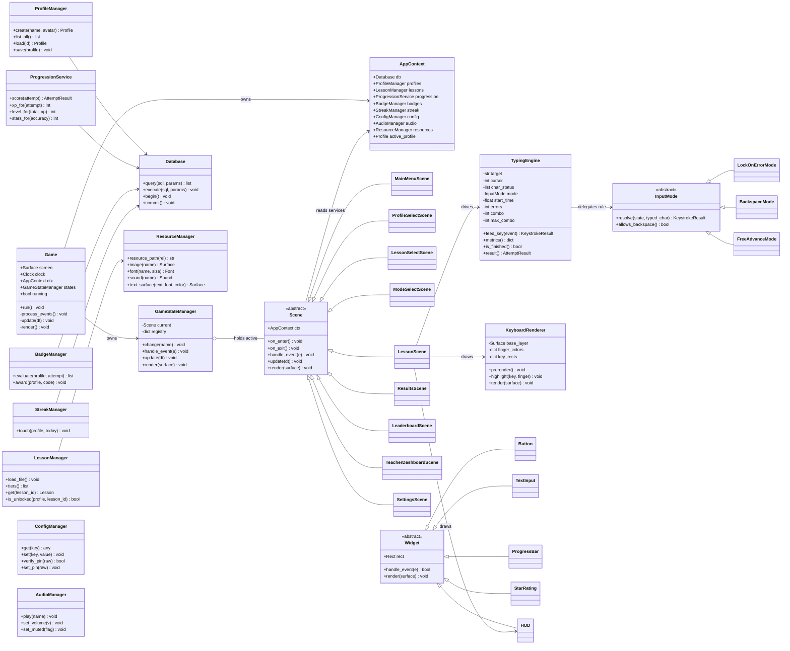
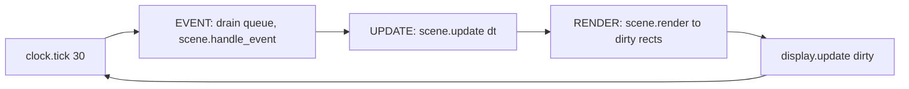
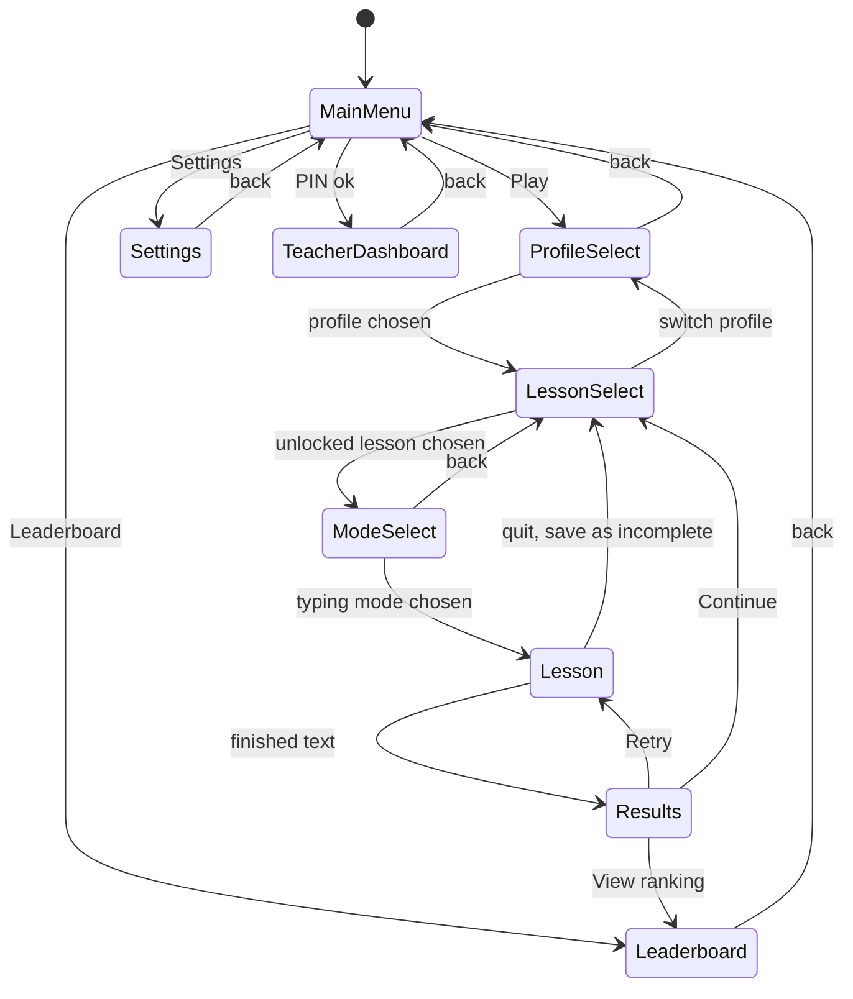
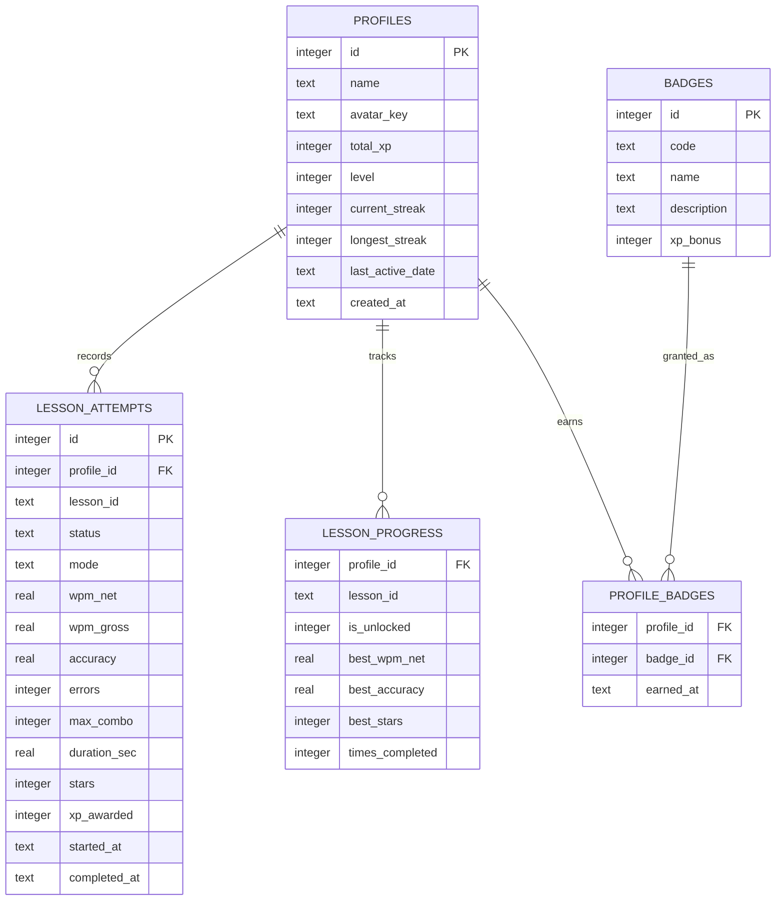
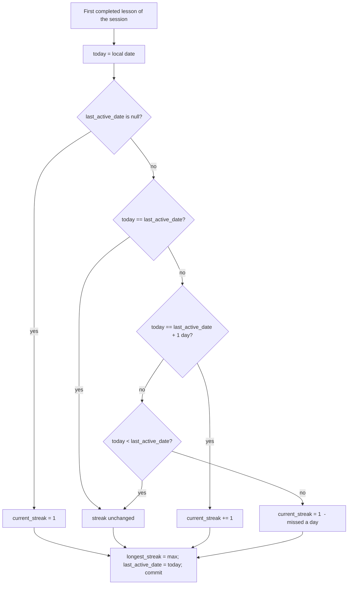
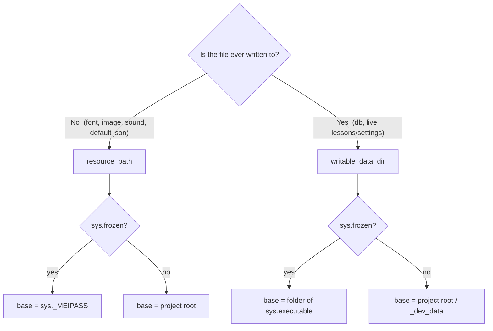

# TypeCraft — Master Technical Blueprint & Execution Plan

**Project:** TypeCraft — An Offline Typing Tutor Game for The Bridge School
**Team:** Shaheer Qureshi (Developer A) · Rayyan Aamir Alvi (Developer B)
**Target hardware:** Windows 10/11, 4th-gen Intel CPU, integrated graphics, low RAM
**Constraints:** 100% offline · 30 FPS · single-folder PyInstaller build · no implementation code in this document
**Document type:** Zero-code architecture, data-flow, interface-contract, and project-management blueprint

---

## 0. How to read this document & locked design decisions

This is the single source of truth for the Phase 1 build. It contains **no `.py` files** — only the system design, interface contracts, and the build plan. Before either of you writes a line of code, read sections 1–3 end to end and the four locked decisions below. These four were ambiguous in the project manual; we have now frozen them, and the whole architecture depends on them.

| # | Decision | Locked choice | Why it matters architecturally |
|---|----------|---------------|--------------------------------|
| D1 | **Wrong-key behavior** | **Selectable per lesson.** Before a lesson starts the student/teacher picks one of three modes. | Forces a *Strategy pattern* in the typing engine instead of a hard-coded `if`. The engine must not "know" the rule — it delegates to a swappable `InputMode`. |
| D2 | **Lesson unlock rule** | **Accuracy ≥ 85%** unlocks the next lesson. Unlimited retries. WPM does **not** gate progress. | Unlock logic reads one number (accuracy) from the best completed attempt. Keeps progression child-friendly and the query trivial. |
| D3 | **Mid-lesson exit / crash** | **Save the partial attempt, mark it `incomplete`.** Incomplete rows are excluded from averages, the leaderboard, and unlock checks. | Requires a `status` column and a checkpoint-write strategy, plus a startup "reclassify orphaned `in_progress` rows" step to survive power cuts. |
| D4 | **Daily streak** | **Local calendar day.** Consecutive days increment; **one full missed day resets to 0.** | Needs only `last_active_date` + `current_streak` on the profile. A clock-moved-backward guard prevents accidental resets. |

> **Why "the why" matters here:** you are both strong at Python and OOP but new to game architecture. Every diagram below is annotated with the reasoning so you learn the *pattern*, not just the layout. If you ever feel a class is doing two unrelated jobs, that is the architecture telling you to split it — come back to this document.

---

## 1. System Architecture & OOP Design

### 1.1 The big idea: a state machine driving a fixed game loop

TypeCraft is **one window** that shows **one screen at a time** (menu, lesson, results, …). The cleanest way to model "one screen at a time" is a **finite state machine**: each screen is a `Scene` (a state), and a `GameStateManager` swaps the active scene. A single `Game` object owns the main loop and pushes every frame's work down into whichever scene is currently active.

This gives us three properties we need:

- **Separation of concerns** — menu code never touches lesson code; they are different classes in different files (this is also what lets you two work in parallel without merge conflicts, see §4).
- **Predictable transitions** — there is exactly one path in and one path out of each screen, and it is drawn in §1.4.
- **Cheap rendering** — only the active scene draws, so we never waste the integrated GPU on hidden screens.

### 1.2 Core class diagram



### 1.3 The Event → Update → Render loop (the heartbeat)

Every Pygame game is a loop that runs ~30 times per second. Each pass ("frame") does exactly three things, in this order. `Game.run()` owns the loop; it never contains screen-specific logic — it just forwards each phase to the active scene through the `GameStateManager`.

1. **EVENT (input)** — Drain Pygame's event queue once (`pygame.event.get()`). Mouse clicks, key presses, and the window-close event are handed to `current_scene.handle_event(e)`. *Input is captured here and nowhere else.* This is also the only place where, during a lesson, a keystroke is pushed into `TypingEngine.feed_key()`.
2. **UPDATE (logic)** — Advance game state by `dt` (the seconds since the last frame, from `clock.tick(30)`). The active scene updates timers, the countdown, combo decay, button hover states, and animations. **No drawing happens here.** Crucially, the typing metrics are recomputed only when a keystroke event arrived, not every frame (see §5) — `update` mostly advances the lesson timer.
3. **RENDER (output)** — The active scene draws itself onto the screen surface, then we flip only the changed regions to the display (`pygame.display.update(dirty_rects)`, not a full `flip()` — see §5). 



**Why this separation is non-negotiable:** mixing input/logic/drawing is the #1 cause of unmaintainable game code and of frame-rate stalls on weak hardware. Keeping the three phases distinct means we can optimize rendering (§5) without touching logic, and test logic (the engine, the math) with scripted inputs and **no window open at all**.

### 1.4 State transitions (Menu → Lesson → Results)

The `GameStateManager` only ever holds **one** active scene. A transition is: call `current.on_exit()` (free heavy surfaces, stop sounds), switch the reference, call `next.on_enter()` (build that screen's widgets, load its lesson). Scenes never call each other directly — they ask the manager to `change("results")`. This keeps the graph below the *complete* contract of legal moves.



**Reading the two edges out of `Lesson`:** the normal exit produces a *completed* attempt and goes to `Results`. The quit edge (Esc / window close mid-lesson) writes the partial attempt as `status=incomplete` per **D3** and returns to lesson select — never to results, because there is no score to celebrate.

### 1.5 The Strategy pattern for wrong-key behavior (decision D1)

Because the typing mode is selectable per lesson, the engine must not contain `if mode == "lock": ... elif ...`. Instead, `TypingEngine` holds a reference to an `InputMode` object chosen on the `ModeSelect` screen, and on every keystroke it calls `mode.resolve(state, typed_char)`. The three concrete strategies answer one question — *"given the expected character and what the student typed, what happens to the cursor, the error count, and the on-screen colour?"*

| Mode | `resolve()` behaviour on a wrong key | Backspace | Best for |
|------|--------------------------------------|-----------|----------|
| `LockOnErrorMode` | Cursor does **not** advance; mark error; flash the key red; wait for the correct key. | n/a | Youngest beginners — builds correct finger habit, no way to "run away" from a key. |
| `BackspaceMode` | Advance, mark the character red; student may press Backspace to go back and fix it. | Yes | Confident learners practising self-correction. |
| `FreeAdvanceMode` | Advance regardless, leave the character red (uncorrected error). | No | Speed drills / exam-style runs. |

**Why this is worth a pattern:** it makes the three behaviours independently testable, lets a teacher add a fourth mode later without editing the engine, and keeps the WPM/accuracy math (§2.4) identical across modes because all three report the same `KeystrokeResult` shape. This is the textbook payoff of the Open/Closed Principle, and a great thing for you both to learn on a real feature.

---

## 2. Database, Data Structures & Game Math

### 2.1 Storage split: SQLite for student data, JSON for content & config

Two different jobs, two different stores, on purpose:

- **`typecraft.db` (SQLite)** holds everything that *changes as students play* — profiles, attempts, progress, badges. Relational, transactional, survives power cuts, and the whole thing is one file a teacher can copy to a USB stick to back up.
- **JSON flat files** hold everything a *teacher should be able to edit in Notepad* — the lessons themselves (`lessons.json`), the badge catalogue (`badges.json`), encouragement text, and settings (`settings.json`, including the teacher PIN **hash**). No code, no database tool required.

> **Critical separation (ties into §3):** the SQLite file and the editable JSON are **writable** and live *beside the .exe*, never inside the PyInstaller bundle. Fonts/images/sounds are **read-only** and live *inside* the bundle. Getting this wrong silently wipes student data on every launch — §3.3 explains exactly how to avoid it.

### 2.2 Entity-Relationship Diagram (SQLite schema)



**Design notes for the implementer (Shaheer):**

- `lesson_id` is a **string key into `lessons.json`** (e.g. `"t1l3"`), not a foreign key to a DB table — lessons live in JSON so teachers can edit them. Treat it as a logical reference; validate it against the loaded lesson set at runtime.
- `LESSON_ATTEMPTS.status` is one of `in_progress` / `complete` / `incomplete` (decision **D3**). Every aggregate query (averages, leaderboard, unlock check, teacher dashboard) **must filter `status = 'complete'`**. Write this as a shared helper so it is impossible to forget.
- `LESSON_PROGRESS` is a small *denormalised cache* of each student's best result per lesson. It exists so the lesson-select grid and unlock check read **one indexed row** instead of scanning every attempt — a deliberate low-end-hardware optimisation. It is updated inside the same transaction that writes a completed attempt.
- Dates are stored as **ISO-8601 text in local time** (`YYYY-MM-DD` for `last_active_date`, full timestamp for the rest). SQLite has no native date type; text sorts correctly and is human-readable for backups.
- Put indexes on `LESSON_ATTEMPTS(profile_id, lesson_id, status)` and the `LESSON_PROGRESS` composite primary key `(profile_id, lesson_id)`.

### 2.3 `lessons.json` — exact structure

Teachers edit only `title`, `lines`, and optionally `target_wpm`. **Never renumber or reuse an `id`** — attempts in the database point at it. The file is validated on load; a malformed file falls back to the bundled default and shows a teacher-facing warning.

```json
{
  "schema_version": 1,
  "tiers": [
    {
      "tier": 1,
      "name": "Home Row",
      "color": "#4CAF50",
      "lessons": [
        {
          "id": "t1l1",
          "order": 1,
          "title": "Home Row: f and j",
          "finger_focus": ["left_index", "right_index"],
          "default_mode": "lock_on_error",
          "target_wpm": 8,
          "lines": [
            "fff jjj fff jjj",
            "fj fj jf jf fjfj",
            "jff jjf fjj fff"
          ]
        },
        {
          "id": "t1l2",
          "order": 2,
          "title": "Home Row: a s d f j k l ;",
          "finger_focus": ["left_pinky", "left_ring", "left_middle", "left_index",
                            "right_index", "right_middle", "right_ring", "right_pinky"],
          "default_mode": "lock_on_error",
          "target_wpm": 10,
          "lines": [
            "asdf jkl; asdf jkl;",
            "a sad lad asks dad",
            "all fall; a flask"
          ]
        }
      ]
    },
    {
      "tier": 2,
      "name": "Top Row",
      "color": "#2196F3",
      "lessons": [
        {
          "id": "t2l1",
          "order": 1,
          "title": "Top Row: q w e r t y",
          "finger_focus": ["left_pinky", "left_ring", "left_middle", "left_index",
                            "right_index"],
          "default_mode": "backspace",
          "target_wpm": 12,
          "lines": [
            "qwe rty qwe rty",
            "we try to write",
            "type the query quietly"
          ]
        }
      ]
    }
  ]
}
```

**Field contract:**

| Field | Type | Who edits | Notes |
|-------|------|-----------|-------|
| `schema_version` | int | dev only | Bump if the shape changes; loader checks it. |
| `tier` / `name` / `color` | int / str / hex | dev | Tier grouping + the colour of its tab in lesson select. |
| `id` | str | **never change** | Stable key stored in the DB. Convention `t{tier}l{order}`. |
| `order` | int | dev | Sort order within a tier; also the unlock chain order. |
| `title` | str | teacher ok | Shown on cards & results. |
| `finger_focus` | list of finger keys | dev | Drives which keys/fingers the keyboard widget highlights as "today's focus". Allowed values are the 8 finger keys used by the colour map in §1.2. |
| `default_mode` | enum | dev | `lock_on_error` / `backspace` / `free_advance` — the mode pre-selected on `ModeSelect`. Student may override. |
| `target_wpm` | int | teacher ok | Used for the optional speed bonus and encouragement, **not** for unlocking (decision D2). |
| `lines` | list of str | **teacher ok** | The actual text to type. Each string is one drill line. |

### 2.4 Game Math (the formulas, defined exactly)

All metrics use the standard typing convention that **one "word" = 5 characters** (this is the industry norm so our WPM is comparable to other tutors). Let `T` = elapsed time in **minutes**, measured from the first keystroke to completion.

**Keystroke bookkeeping** (the engine maintains these counters; they are mode-agnostic because every `InputMode` reports the same `KeystrokeResult`):

- `total_keystrokes` = every character-producing key the student pressed (excludes Backspace and modifiers).
- `errors` = keystrokes where the typed character ≠ the expected character at that position.
- `correct_keystrokes` = `total_keystrokes − errors`.

**Accuracy %**

```
accuracy = (correct_keystrokes / total_keystrokes) * 100
```
(If `total_keystrokes == 0`, accuracy is reported as 0 to avoid divide-by-zero.)

**Words Per Minute** — we display two, and score on the second:

```
gross_wpm = (total_keystrokes / 5) / T
net_wpm   = (correct_keystrokes / 5) / T
```

`net_wpm` is mathematically `gross_wpm × (accuracy / 100)` — i.e. *only correctly typed characters count toward your speed.* This is intuitive for children ("type fast **and** correctly"), is identical across all three input modes, and is the value stored as `wpm_net` and ranked on the leaderboard. `gross_wpm` is shown live for transparency. Both are floored at 0.

**Combo streak** — `combo` = current run of consecutive correct keystrokes; any error resets it to 0; `max_combo` is the high-water mark for the attempt (feeds the "Combo King" badge and a small XP bonus).

**Star rating** (accuracy-based, aligned with the 85% pass line from D2; WPM never blocks a star):

```
accuracy < 85   -> 0 stars  (FAIL: lesson NOT passed, next stays locked)
85 <= acc < 92  -> 1 star
92 <= acc < 97  -> 2 stars
acc >= 97       -> 3 stars
```

**XP awarded for an attempt**

```
if accuracy < 85:
    xp = round(5 * accuracy / 100)          # participation only (max 4), no unlock

else:
    speed_bonus = min(net_wpm, 40) * 0.5    # 0..20, rewards but caps speed
    star_mult   = {1: 1.0, 2: 1.3, 3: 1.6}[stars]
    tier_mult   = 1.0 + 0.1 * (tier - 1)    # Tier 1 = 1.0 ... Tier 5 = 1.4
    xp = round((20 + speed_bonus) * (accuracy / 100) * star_mult * tier_mult)
```

Worked examples (verified numerically): Tier 1 @ 88% / 18 wpm → **1★, 26 XP**; Tier 3 @ 94% / 22 wpm → **2★, 45 XP**; Tier 5 @ 99% / 40 wpm → **3★, 89 XP**.

**XP curve & levels (10 tiers).** The cumulative XP needed to *reach* level `L` is a triangular curve:

```
xp_to_reach(L) = 25 * (L - 1) * L          # L = 1..10, capped at level 10
level_for(total_xp) = highest L where xp_to_reach(L) <= total_xp
```

| Level | XP to reach | Gap from previous |
|------:|------------:|------------------:|
| 1 | 0 | — |
| 2 | **50** | 50 |
| 3 | 150 | 100 |
| 4 | 300 | 150 |
| 5 | 500 | 200 |
| 6 | 750 | 250 |
| 7 | 1050 | 300 |
| 8 | 1400 | 350 |
| 9 | 1800 | 400 |
| 10 | **2250** | 450 |

Early levels arrive fast (≈2–3 good lessons reach Level 2) for motivation; later levels stretch out so Level 10 is a genuine achievement. **Level 10 is reachable** because the economy has three XP sources, not just lessons: ~2,000 XP from clearing and replaying the 20+ lessons toward 3★, **plus ~625 XP** from the badge catalogue (§2.5), **plus** a small daily-streak bonus (`+5 × min(current_streak, 5)` on the first lesson each day). The badge + streak XP is what carries a dedicated student over the 2,250 line.

### 2.5 Badges (10) and encouragement

The badge catalogue lives in `badges.json` (so it is editable and re-evaluated centrally). `BadgeManager.evaluate()` runs after every completed attempt and after streak/level updates, awarding any newly-met badge exactly once and adding its `xp_bonus`.

| Code | Name | Criterion | XP bonus |
|------|------|-----------|---------:|
| `first_steps` | First Steps | Complete your first lesson | 25 |
| `home_row_hero` | Home Row Hero | Complete every Tier 1 lesson | 50 |
| `sharp_shooter` | Sharp Shooter | Finish a lesson at 100% accuracy | 60 |
| `speed_demon` | Speed Demon | Reach 30 net WPM in any lesson | 50 |
| `combo_king` | Combo King | Hit a 50-keystroke combo | 50 |
| `perfect_week` | Perfect Week | 7-day streak | 75 |
| `triple_star` | Triple Star | Earn 3★ on 5 different lessons | 75 |
| `rising_star` | Rising Star | Reach Level 5 | 40 |
| `keyboard_master` | Keyboard Master | Reach Level 10 | 100 |
| `marathon` | Marathon | Complete 25 lessons total | 100 |

**Encouragement messages** are banded by result and read from JSON (e.g. `messages.encourage_low`, `_mid`, `_high`, `_perfect`); the results screen picks one at random from the matching band so children see variety, never canned repetition. Keep them short, warm, and age-appropriate.

### 2.6 Daily streak algorithm (decision D4)

`StreakManager.touch(profile, today)` runs once when a student completes their first lesson of a session. `today` is the **local** calendar date (`YYYY-MM-DD`).



The `today < last_active_date` branch is the **clock-moved-backward guard**: on shared school PCs the system clock can be wrong, and we never punish a student by resetting their streak when the date appears to go backwards — we treat it as "same day, no change."

---

## 3. Directory Structure & Asset Pipeline

### 3.1 Modular project layout

The folder boundaries below are also the **ownership boundaries** that let you two work in parallel (§4). Each top-level package is a clear responsibility; files inside one package rarely import "sideways" into another except through the manager interfaces.

```
TypeCraft/
├─ main.py                  # tiny entry point: build AppContext, start Game.run()  (SHARED, rarely edited)
├─ requirements.txt
├─ TypeCraft.spec           # PyInstaller build recipe (Shaheer)
│
├─ core/                    # the spine — SHARED, change only at integration gates
│   ├─ game.py              #   Game: window + 30 FPS loop (Event/Update/Render)
│   ├─ app_context.py       #   AppContext: holds the manager singletons
│   ├─ state_manager.py     #   GameStateManager
│   ├─ scene.py             #   Scene abstract base
│   └─ paths.py             #   resource_path() + writable_data_dir()  <-- see 3.3
│
├─ engine/                  # typing logic — SHAHEER
│   ├─ typing_engine.py
│   ├─ input_modes.py       #   InputMode + Lock/Backspace/FreeAdvance
│   └─ metrics.py           #   WPM / accuracy / stars pure functions
│
├─ managers/                # data & rules — SHAHEER
│   ├─ database.py          #   sqlite3 wrapper + schema bootstrap
│   ├─ profile_manager.py
│   ├─ lesson_manager.py
│   ├─ progression.py       #   XP / level / stars
│   ├─ badge_manager.py
│   ├─ streak_manager.py
│   └─ config_manager.py    #   settings.json + hashlib PIN
│
├─ models/                  # plain data holders — SHAHEER (shared, stable)
│   ├─ profile.py
│   ├─ lesson.py
│   └─ attempt.py           #   AttemptResult, KeystrokeResult
│
├─ scenes/                  # one file per screen — RAYYAN
│   ├─ main_menu.py
│   ├─ profile_select.py
│   ├─ lesson_select.py
│   ├─ mode_select.py
│   ├─ lesson.py            #   LessonScene: drives TypingEngine + KeyboardRenderer
│   ├─ results.py
│   ├─ leaderboard.py
│   ├─ teacher_dashboard.py
│   └─ settings.py
│
├─ ui/                      # reusable widgets — RAYYAN
│   ├─ widget.py            #   Widget base
│   ├─ button.py
│   ├─ text_input.py
│   ├─ keyboard_renderer.py #   on-screen QWERTY + 8-finger colour map
│   ├─ hud.py               #   live WPM/acc/combo/timer/mistakes
│   ├─ progress_bar.py
│   ├─ star_rating.py
│   ├─ audio_manager.py     #   pygame.mixer wrapper
│   ├─ resource_manager.py  #   image/font/sound load + SURFACE CACHE
│   └─ theme.py             #   colours, sizes, fonts — the one place to restyle
│
├─ assets/                  # READ-ONLY, gets bundled INTO the exe
│   ├─ images/
│   ├─ fonts/
│   └─ sounds/
│
└─ data/                    # DEFAULT copies, bundled; live writable copies sit beside the exe
    ├─ lessons.json
    ├─ badges.json
    ├─ messages.json
    └─ settings.default.json
```

### 3.2 The asset access rule of thumb

There are exactly **two kinds of files** and they are reached two different ways. Burn this into both your heads:

- **Read-only resources** (fonts, images, sounds, and the *default* JSON shipped as a fallback) → always opened through `core/paths.py:resource_path()`. Never written to.
- **Writable data** (`typecraft.db`, the *live* `lessons.json`/`badges.json`/`messages.json`, and `settings.json`) → always opened through `writable_data_dir()`, which points beside the executable.

Every file open in the codebase must go through one of those two helpers. Direct relative paths like `open("data/lessons.json")` are **banned** — they work when you run from source and break the moment it is packaged.

### 3.3 PyInstaller: solving `sys._MEIPASS` (the critical part)

**The problem.** PyInstaller bundles your data files, but at runtime it unpacks read-only resources into a temporary folder and tells you where via `sys._MEIPASS`. Two traps catch every first-time team:

1. If you load fonts/images with a plain relative path, they are **not found** once frozen, because the working directory is not your source folder.
2. If you write your SQLite DB *into* the bundled location, you are writing into that temporary `_MEIPASS` folder (or the read-only `_internal` folder) — which is **wiped / not persisted**, so **every student's progress vanishes between runs.** This is the single most dangerous bug in this project.

**The solution — two helper functions in `core/paths.py` (described, not coded):**

`resource_path(relative)` — for **read-only bundled** files:
- If `getattr(sys, "frozen", False)` is true (we are running as a packaged exe), the base directory is `sys._MEIPASS`.
- Otherwise (running from source during development) the base directory is the project root.
- Return `base / relative`. Use this for everything under `assets/` and for reading *default* JSON.

`writable_data_dir()` — for **writable persistent** files:
- If frozen, the base is the folder that contains the executable: `Path(sys.executable).parent`.
- Otherwise, the project root (or a local `./_dev_data` so dev runs don't dirty the repo).
- Ensure the directory exists and return it. The DB and the live editable JSON live here.



**First-run seeding.** On startup the app checks `writable_data_dir()` for `typecraft.db`, `lessons.json`, `badges.json`, `messages.json`, and `settings.json`. For any that are missing, it **copies the bundled default** (read via `resource_path`) into the writable dir, then opens the writable copy. Result: a freshly-deployed folder self-initialises on first launch, and from then on the teacher's edited `lessons.json` and all student data persist next to `TypeCraft.exe`.

**Build configuration (`TypeCraft.spec`):**
- Use **`--onedir`, not `--onefile`.** One-file re-extracts the entire app to a temp folder on **every launch** — slow and painful on 4th-gen Intel with a spinning disk. One-dir extracts nothing at launch, starts faster, and lets the writable DB sit cleanly beside the exe. The manual's "single folder distributed via USB" maps exactly to `--onedir`.
- Bundle resources with `--add-data` (or the `datas=[...]` list in the spec): include `assets/` and the `data/` defaults.
- `--windowed` (no console window), `--name TypeCraft`, and an `--icon`.
- After build, the distribution is `dist/TypeCraft/` containing `TypeCraft.exe`, the `_internal/` bundle folder, and (after first run) the writable `typecraft.db` + editable JSON. **That whole folder is what gets copied to a USB drive.**
- Backup story for teachers: "copy `typecraft.db` to your USB stick." Restore: drop it back beside the exe.

---

## 4. Granular Task Delegation Plan (Phase 1 build)

### 4.1 Roles & the anti-merge-conflict strategy

| | Developer A — **Shaheer** | Developer B — **Rayyan** |
|---|---|---|
| **Owns folders** | `engine/`, `managers/`, `models/`, `data/`, `TypeCraft.spec` | `scenes/`, `ui/` |
| **Domain** | Data, rules, math, persistence, packaging | Everything drawn on screen + input feel |
| **Touches `core/` when** | adds a manager to `AppContext`, edits `paths.py` | edits `game.py` loop, `scene.py` base |

The reason you can build in parallel without stepping on each other is that **you each own different folders.** Git merge conflicts happen when two people edit the same lines of the same file; here, Shaheer almost never opens a file in `ui/`, and Rayyan almost never opens one in `engine/`. The only shared, contested files are in `core/` and `main.py` — so we keep those tiny and only change them together at the scheduled **integration gates**.

**Git workflow (local, no remote — per the manual):** `main` stays always-runnable. Each of you works on a personal branch (`shaheer/…`, `rayyan/…`) and merges into `main` only at an integration gate, after a 5-minute joint smoke test. Commit small and often. Tag `v1.0` at the end.

### 4.2 The contracts to FREEZE on Day 1 (before any feature code)

Parallel work only stays conflict-free if the *seams* are agreed up front. On Day 1, write these signatures into the relevant files as empty stubs (raise `NotImplementedError`) and commit them to `main`. After this, Rayyan can build UI against a fake engine and Shaheer can build logic with no window — neither is blocked on the other.

- **`TypingEngine`** — `feed_key(event) -> KeystrokeResult`, `metrics() -> dict`, `is_finished() -> bool`, `result() -> AttemptResult`. (Rayyan's `LessonScene` only ever calls these four.)
- **`InputMode`** — `resolve(state, typed_char) -> KeystrokeResult`, `allows_backspace() -> bool`.
- **`AppContext`** — the attribute names of every manager (so scenes know how to reach them).
- **`Database`** — `query(sql, params) -> list`, `execute(sql, params)`, transaction helpers.
- **Manager method names** — `ProfileManager`, `LessonManager.is_unlocked(...)`, `ProgressionService.score(...)`, etc., as in §1.2.
- **`Widget`** base — `handle_event(e) -> bool`, `render(surface)`.
- **`ResourceManager`** — `image/font/sound/text_surface` + `resource_path`.
- **Data shapes** — `KeystrokeResult` and `AttemptResult` fields (from `models/`), and the `lessons.json` schema (§2.3).

### 4.3 Sprint plan (sequence and effort, no calendar)

The plan is ordered by dependency, not by calendar dates. Run the phases in the sequence below, each sized in **working days** (treat one focused dev session as one "day" and adjust to your own pace). "Gate" rows are joint integration checkpoints where both branches merge to `main`; do not start a phase until the previous phase’s gate passes.

**Phase 0 — Setup & Design · ~5 working days (Days 1-5)**

| Day | Shaheer (A) | Rayyan (B) | Gate / output |
|------|-------------|------------|---------------|
| 1 | Repo + `.gitignore` + branches; **freeze all contracts (§4.2)** as stubs | Co-author the contracts; agree `theme.py` colours/sizes | Stubs compile & run on both machines |
| 2 | `database.py`: schema bootstrap + DAO; `paths.py` helpers | `game.py` 30 FPS loop skeleton + `scene.py` + `GameStateManager` | Empty window opens at 30 FPS |
| 3 | `lessons.json` Tier 1–2 content + `LessonManager.load/validate` | `Button` + `TextInput` widgets against `theme.py` | — |
| 4 | `ProfileManager` + `Profile` model + CRUD | `MainMenuScene` layout + navigation wiring | — |
| 5 | First-run seeding of db/json | `ProfileSelectScene` shell | **Gate:** menu → create/select profile persists to DB |

**Phase 1 — Core Engine · ~3 working days (Days 6-8)**

| Day | Shaheer (A) | Rayyan (B) | Gate / output |
|------|-------------|------------|---------------|
| 6 | `TypingEngine` core: cursor, per-char status, timing, counters | `KeyboardRenderer`: static QWERTY pre-rendered + 8-finger colour map | — |
| 7 | `input_modes.py`: 3 strategies; `metrics.py` WPM/accuracy/combo | `LessonScene` shell: render target text + live `HUD`, call engine | — |
| 8 | Scripted-input unit checks of metrics (no window) | Wire keyboard highlight + green/red per-char feedback to engine | **Gate:** real engine + scene + keyboard typeable end-to-end |

**Planned pause: Eid-ul-Adha break, no development. Slot it wherever it falls for your team.**

**Phase 2 — UI Implementation · ~7 working days (Days 9-15)**

| Day | Shaheer (A) | Rayyan (B) | Gate / output |
|------|-------------|------------|---------------|
| 9 | `ProgressionService`: XP/level/stars wired to `AttemptResult` | `ProfileSelectScene` finished + avatar picker | — |
| 10 | Unlock logic (≥85%) + `LESSON_PROGRESS` cache writes | `LessonSelectScene`: tiers, lock icons, star badges | — |
| 11 | Attempt persistence + `in_progress→incomplete` handling (D3) | `ModeSelectScene` (pick typing mode, default from lesson) | — |
| 12 | `messages.json` bank + encouragement selection + combo bonus | `ResultsScene`: stars, XP-gain animation, message | — |
| 13 | `ConfigManager`: `settings.json` + hashlib PIN set/verify | Keyboard finger-guide polish + active-finger legend | — |
| 14 | `AudioManager` service (load/cache/mute) | `SettingsScene` UI + volume slider + mute, audio wiring | — |
| 15 | Join + fix | Join + fix | **Gate:** full Menu→Profile→Lesson→Results loop playable |

**Phase 3 — Gamification & Data · ~5 working days (Days 16-20)**

| Day | Shaheer (A) | Rayyan (B) | Gate / output |
|------|-------------|------------|---------------|
| 16 | `BadgeManager`: 10 rules + award + `xp_bonus` + persistence | Badge unlock toast + badge shelf on profile | — |
| 17 | `StreakManager` (D4) + clock-back guard | Streak display widget + daily greeting | — |
| 18 | Leaderboard queries (best net WPM / accuracy, exclude incomplete) | `LeaderboardScene` (two tabs) | — |
| 19 | Teacher dashboard data + reset-progress transaction | `TeacherDashboardScene` UI + PIN gate | — |
| 20 | Join + fix | Join + fix | **Gate:** full offline data layer verified; reset safe |

**Phase 4 — Testing & Optimisation · ~3 working days (Days 21-23)**

| Day | Shaheer (A) | Rayyan (B) | Gate / output |
|------|-------------|------------|---------------|
| 21 | Logic/data bugs: empty profile, clock change, crash→incomplete reclassify | Play through **all 20 lessons**, log UI/render bugs | Bug list triaged |
| 22 | Profile with `cProfile`; trim DB write cadence | Apply §5: dirty-rects, font cache, `convert()`, pre-rendered keyboard | FPS counter holds 30 |
| 23 | Memory check; finalise edge cases | Usability fixes from a child test-run | **Gate:** stable 30 FPS on low-end target |

**Phase 5 — Packaging & Docs · ~3 working days (Days 24-26)**

| Day | Shaheer (A) | Rayyan (B) | Gate / output |
|------|-------------|------------|---------------|
| 24 | `TypeCraft.spec` (onedir, add-data, seeding); build exe; test clean folder | Begin docs (screenshots from the build) | A working `dist/TypeCraft/` |
| 25 | Deployment guide + USB copy test + DB backup note; smoke-test on old PC | Teacher quick-start + student guide + `lessons.json` editing guide | — |
| 26 | Final QA on packaged build; fix any path bugs; **tag `v1.0`** | Finalise docs; assemble handover folder | **Gate:** signed-off v1.0 deliverable |

> **Buffer note:** the phase order is a hard dependency chain even without dates, so never skip a gate (total effort is roughly 26 working days). If you fall behind your own pace, the cut-line is *polish*, never the data-integrity work (D3 incomplete-handling, first-run seeding, the `_MEIPASS` path strategy) — those are load-bearing for the on-site deployment phase later.

---

## 5. Performance Optimization Strategy (4th-gen Intel + integrated graphics)

The target machine has a weak CPU, an integrated GPU sharing system RAM, and likely a spinning hard disk. Our budget is **33.3 ms per frame** (30 FPS). The good news: a typing tutor is a *mostly static* screen — the text, keyboard, and HUD barely change between frames. We exploit that relentlessly. Techniques are ordered by impact.

### 5.1 Don't redraw what didn't change — dirty-rect rendering

A naive game clears the whole screen and redraws everything every frame, then calls `pygame.display.flip()`. On integrated graphics, blitting a full 1280×720 screen 30×/second is the biggest avoidable cost. Instead:

- Draw the **static background once** (menu art, the keyboard, lesson frame) to a surface at `on_enter`.
- Each frame, redraw **only the regions that actually changed** — the current character, the previously-typed character, the active key, and the HUD numbers — and collect their rectangles into a list.
- Call **`pygame.display.update(dirty_rects)`**, never the full-screen `flip()`. You are now pushing a few hundred pixels to the GPU per frame instead of nearly a million.

This single change is typically the difference between a steady 30 FPS and a stuttering one on this hardware.

### 5.2 Pre-render and cache font surfaces (the manual calls this out)

`font.render()` rasterises text from scratch — it is **expensive**, and calling it every frame for the lesson text and live stats will alone blow the frame budget. Text rendering should happen *on change, not per frame*:

- **Lesson text:** render each character (or each word) to a surface **once** when the lesson loads, in its neutral colour. Keep three pre-rendered colour variants per glyph — neutral / green / red — and on a keystroke just swap which cached surface is blitted. No re-rasterisation while typing.
- **HUD numbers:** pre-render the digit glyphs `0`–`9` (and `%`, `:`) once; compose WPM/accuracy/timer readouts by blitting cached digits. Re-render a stat's surface only when its value changes, not every frame.
- **Central cache in `ResourceManager.text_surface(text, font, colour)`** — a dict keyed by `(text, font_id, colour)`. First call renders and stores; later calls return the cached surface. Every scene uses this; nobody calls `font.render()` directly.

### 5.3 Pre-render the keyboard once

The on-screen QWERTY with its 8-finger colour coding is static geometry. `KeyboardRenderer.prerender()` draws the entire keyboard (keys, labels, finger colours) to **one base surface** at scene entry. Per frame we blit that base once into the (dirty) keyboard region and overlay **only** the single highlighted key. We never re-draw 40+ keys individually each frame.

### 5.4 Convert every image to the display format at load

A loaded PNG is in its own pixel format; blitting it forces a per-pixel conversion **every** blit. Call **`.convert()`** (opaque images) or **`.convert_alpha()`** (transparency) **once at load**, inside `ResourceManager`, so the surface matches the screen's format. Blits then become fast memory copies. This is a large, free win on integrated GPUs and must be done for *every* asset. Also pre-scale images to their final display size at load time — never scale per frame.

### 5.5 Event-driven logic, not per-frame polling

Typing metrics only change when a key is pressed, so recompute WPM/accuracy/combo **inside the keystroke event handler**, not in `update()`. The per-frame `update()` then does almost nothing — advance the countdown timer and any active tween. The CPU stays idle between keystrokes, which on a laptop also means less heat and better sustained clocks.

### 5.6 Keep I/O and allocation off the frame path

- **SQLite writes** never happen mid-frame in a tight loop. The single completed-attempt write occurs at lesson end; the optional `in_progress` checkpoint (D3) fires at most once per completed line or every ~10 s — not per keystroke — to protect a spinning disk.
- **No per-frame object allocation.** Reuse surfaces, rects, and font objects; build them at `on_enter`. Churn here causes GC pauses that show up as frame hitches.
- **Load assets at `on_enter`, free at `on_exit`.** Only the active scene's assets sit in RAM — important on low-memory machines.

### 5.7 Sensible global settings

- `clock.tick(30)` caps the loop and yields the CPU between frames (don't busy-wait).
- Fixed, modest window (e.g. **1280×720**), no runtime resizing of surfaces.
- `pygame.mixer` initialised with a small buffer and few channels; sounds are tiny (<50 KB) and `convert`-ed once.
- **`--onedir`** packaging (§3.3) so there is no per-launch unpack delay.
- Disable anything you are not using (e.g. don't enable per-pixel alpha on opaque surfaces; avoid large semi-transparent overlays which are fill-rate killers on integrated GPUs).

### 5.8 How you'll know it's fast enough

Ship a hidden FPS counter (toggle key) during development. On the lowest-spec machine you can find, the acceptance bar is: **a sustained 30 FPS during active typing**, no audible audio stutter, and lesson-load under ~1 second. Profile with `cProfile` during Phase 4 (Day 22); if any single frame phase exceeds budget, §5.1 and §5.2 are where the time almost always goes.

---

## 6. Appendix — defaults I locked, and risks to watch

### 6.1 Sensible defaults I chose so you aren't blocked (flag any to change)

Beyond the four frozen decisions, these were unspecified in the manual; I picked the safest option for an offline classroom. Tell me if any should change.

- **Student identity:** students pick their profile from a list (no per-student password) — fastest for young children on a shared PC. An optional 4-digit student PIN can be added later; off by default.
- **Avatars:** chosen from a **bundled sprite set**, not uploaded files — keeps it fully offline and avoids file-dialog complexity.
- **Leaderboard metric:** ranks on **net WPM** (and a separate accuracy board), completed attempts only.
- **Teacher PIN reset (offline, no email):** documented manual reset — deleting the `teacher_pin_hash` key in `settings.json` returns the dashboard to "set a new PIN" on next open. Covered in the teacher guide.
- **Resolution / window:** 1280×720 windowed default.
- **Timer:** a per-lesson countdown is shown for pacing but does **not** fail the lesson — completion is by typing the text, scored by accuracy.

### 6.2 Top risks & mitigations

| Risk | Impact | Mitigation (already designed in) |
|------|--------|----------------------------------|
| Writing the DB into the `_MEIPASS` bundle | **All student data lost between runs** | The `writable_data_dir()` split + first-run seeding (§3.3). Treat as a release blocker. |
| Power cut mid-lesson on school PCs | Orphaned `in_progress` rows | Startup reclassifies orphaned `in_progress` → `incomplete`; aggregates exclude both (D3). |
| Wrong system clock on shared PCs | Broken / inflated streaks | Calendar-day rule + clock-moved-backward guard (D4). |
| `font.render()` per frame | Frame drops below 30 FPS | Pre-rendered, cached glyph surfaces (§5.2). |
| Merge conflicts between you two | Lost time, broken `main` | Folder ownership + frozen contracts + integration-gate merges only (§4). |
| Teacher edits `lessons.json` into invalid JSON | App won't load lessons | Validate on load; fall back to bundled default + show a clear warning (§2.3). |

### 6.3 Definition of done for Phase 1

A packaged `dist/TypeCraft/` folder that, copied fresh to a clean Windows machine via USB, launches with no Python installed; lets a teacher create profiles; runs all 20 lessons across the three typing modes with live green/red feedback, WPM/accuracy/combo, stars, XP, levels, badges, streaks, leaderboard, and PIN-protected teacher dashboard; persists all data beside the exe across restarts and a simulated power cut; holds 30 FPS on a 4th-gen Intel machine; and ships with the four teacher/student/deployment/`lessons.json` documents.

*End of blueprint. The on-site deployment-and-training phase is out of scope for this Phase 1 build plan and will get its own checklist before that work begins.*

